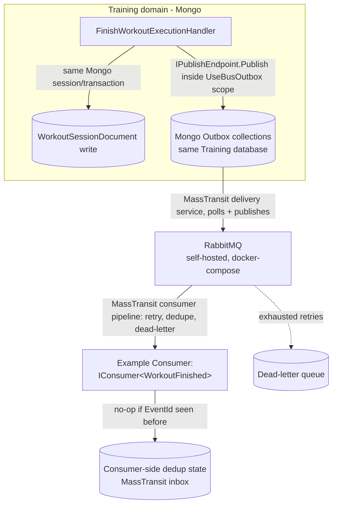

# Event Bus (Outbox + Pluggable Broker) — Design

**Spec**: `ShapeUpApi/.specs/features/event-bus/spec.md`
**Status**: Implemented (Execute complete)

---

## Approach Chosen (confirmed with user)

Two approaches were presented: (A) adopt **MassTransit** (industry-standard .NET service bus abstraction, with built-in Outbox for both EF Core/SQL and MongoDB, retry/redelivery middleware, dead-lettering, and transport-agnostic publish/consume) vs (B) hand-roll a custom `IEventBus` + Outbox table/collection + polling relay `BackgroundService` + `RabbitMQ.Client` adapter. **User confirmed (A) MassTransit + RabbitMQ transport.** Rationale: durability/retry/dead-letter/transport-swap are exactly what MassTransit is built and battle-tested for — reinventing them by hand is where subtle distributed-systems bugs live, which contradicts the explicit "most durable and correct" requirement.

**Uncertainty flagged (Knowledge Verification Chain Step 5):** I confirmed via MassTransit's own docs that `MassTransit.MongoDb`'s `AddMongoDbOutbox` exists and is the documented mechanism, and confirmed `UsingRabbitMq` is the standard transport setup — but I could **not** independently confirm (a) official MassTransit compatibility with the **.NET 10 preview SDK** this project targets (docs/examples found reference net8/net9), or (b) the exact low-level mechanism by which the Mongo outbox achieves atomicity with a domain document write in the *same* transaction (docs describe *what* it does — persist message + dedup state together — not the precise session-sharing wiring). **T1 in tasks.md is a timeboxed spike to verify both before committing to the rest of the build** — if either fails, the fallback is documented in Risks & Concerns below.

---

## Architecture Overview



MassTransit's own `IPublishEndpoint`/`IBus` interfaces ARE the broker-agnostic abstraction — domain code never references `RabbitMQ.Client` types directly, and swapping `UsingRabbitMq(...)` for `UsingAzureServiceBus(...)` (future, not built now) requires no domain code change. No additional custom `IEventBus` wrapper is introduced around MassTransit (would be a redundant abstraction layer around an abstraction that already exists — see Tech Decisions).

---

## Code Reuse Analysis

### Existing Components to Leverage

| Component | Location | How to Use |
|---|---|---|
| `FinishWorkoutExecutionHandler` | `ShapeUpApi/src/Features/Training/Workouts/FinishWorkoutExecution/FinishWorkoutExecutionHandler.cs` | Extended (not rewritten) to publish `WorkoutFinished` inside the same Mongo session as its existing `UpdateCompletionAsync` write |
| `IWorkoutSessionRepository` / Mongo Training database registration | `Features/Training/Infrastructure/` | Existing `IMongoDatabase`/`IMongoClient` DI registration for Training reused as MassTransit's Mongo outbox `ClientFactory`/`DatabaseFactory` |
| OpenTelemetry (Seq) | `Configurations/DependencyInjectionExtensions.cs`, `docker-compose.yml` | Dead-letter/retry-exhausted events logged through the existing OTLP pipeline — no new observability surface needed (spec Out of Scope) |
| `docker-compose.yml` self-hosted pattern (Seq, no SaaS) | root `docker-compose.yml` | RabbitMQ added the same way — official `rabbitmq:management` image, no managed/cloud broker |

### Integration Points

| System | Integration Method |
|---|---|
| MongoDB (`docker-compose.yml`) | Reconfigured from standalone to a **single-node replica set** (`--replSet rs0` + one-time `rs.initiate()`) — required for both the app's own future multi-document transactions and MassTransit's Mongo outbox |
| RabbitMQ | New service in `docker-compose.yml` (`rabbitmq:3-management` — management UI included, matches the project's self-hosted/no-SaaS convention already used for Seq) |
| `Program.cs` / `Configurations/DependencyInjectionExtensions.cs` | New `AddMassTransit(...)` registration block, following the existing pattern of one `Add*Extensions` method per concern |

---

## Components

### MassTransit Bus Registration

- **Purpose**: Wire up MassTransit once for the whole process — RabbitMQ transport, Mongo outbox, and the example consumer
- **Location**: New `Configurations/MessagingExtensions.cs` (mirrors existing `DependencyInjectionExtensions.cs` pattern — one file per cross-cutting concern)
- **Interfaces**: `IServiceCollection.AddMessaging(IConfiguration)` extension method, called once from `Program.cs`
- **Dependencies**: `MassTransit`, `MassTransit.RabbitMQ`, `MassTransit.MongoDb` NuGet packages
- **Reuses**: existing `IMongoClient`/`IMongoDatabase` DI registrations for Training's database (passed into `o.ClientFactory`/`o.DatabaseFactory`)

### `WorkoutFinished` (event contract)

- **Purpose**: The one concrete event this feature ships — proof that a domain can publish through the whole pipe
- **Location**: `Features/Training/Shared/Events/WorkoutFinished.cs` (new) — a plain `record`, no MassTransit-specific base type required
- **Interfaces**: `record WorkoutFinished(string SessionId, int TargetUserId, int ExecutedByUserId, DateTime EndedAtUtc)`
- **Dependencies**: none
- **Reuses**: nothing — new, minimal contract

### `FinishWorkoutExecutionHandler` (extended)

- **Purpose**: Publish `WorkoutFinished` inside the same Mongo transaction as the session's completion write
- **Location**: `Features/Training/Workouts/FinishWorkoutExecution/FinishWorkoutExecutionHandler.cs` (existing file, edited)
- **Interfaces**: constructor gains `IPublishEndpoint publishEndpoint` (MassTransit's own interface); `HandleAsync` calls `await publishEndpoint.Publish(new WorkoutFinished(...))` immediately after the domain write, inside the outbox-managed scope
- **Dependencies**: `IPublishEndpoint` (MassTransit)
- **Reuses**: existing handler structure, existing repository calls — only adds the publish call

### `WorkoutFinishedConsumer` (example consumer)

- **Purpose**: Prove the pipe end-to-end; minimal placeholder that Gamification's own consumer replaces later
- **Location**: `Features/Training/Workouts/FinishWorkoutExecution/WorkoutFinishedConsumer.cs` (new, co-located with the feature that owns the event)
- **Interfaces**: `class WorkoutFinishedConsumer : IConsumer<WorkoutFinished>` — `Consume(ConsumeContext<WorkoutFinished> context)` logs the event (structured log via existing `ILogger`/OpenTelemetry pipeline)
- **Dependencies**: `ILogger<WorkoutFinishedConsumer>`
- **Reuses**: existing logging/observability pipeline

---

## Data Models

No new SQL tables in this feature's scope (no SQL-based domain publishes yet — EF Core outbox pattern is documented here for the *next* domain that needs it, not implemented). MassTransit's Mongo outbox manages its own collections inside Training's existing Mongo database (`Mongo__Training__ConnectionString`) — these are MassTransit-owned collections (delivery/inbox state), not modeled as our own entities; we configure them, we don't hand-roll their schema.

```csharp
// Event contract (ours) - Features/Training/Shared/Events/WorkoutFinished.cs
public record WorkoutFinished(string SessionId, int TargetUserId, int ExecutedByUserId, DateTime EndedAtUtc);
```

**Relationships**: `WorkoutFinished` is emitted once per completed `WorkoutSessionDocument`; carries only the identifiers a consumer needs to look up more detail itself (no full session payload duplicated into the event — avoids the event contract growing every time the session document does).

---

## Error Handling Strategy

| Error Scenario | Handling | User Impact |
|---|---|---|
| Mongo transaction fails while writing session + outbox entry together | Whole transaction rolls back — neither the session completion nor the event exists | `FinishWorkoutExecutionHandler` returns its existing failure `Result` (no change to today's error contract) |
| RabbitMQ unreachable when the outbox delivery service tries to publish | Message stays pending in the outbox, delivery service retries on its next poll (MassTransit default backoff) | None visible to the API caller — the workout-finish request already succeeded (event delivery is decoupled, by design) |
| Consumer throws during `Consume` | MassTransit's built-in retry middleware re-attempts with backoff; after configured attempts, message moves to the `_error` queue (MassTransit's dead-letter convention) | None visible to the API caller; operator investigates via RabbitMQ management UI / Seq logs |
| Duplicate delivery (at-least-once) | Consumer-side inbox (MassTransit's dedup, `DuplicateDetectionWindow`) — or the consumer's own idempotency check for anything outside that window — ignores the repeat | None; effect applied once |

---

## Risks & Concerns

| Concern | Location | Impact | Mitigation |
|---|---|---|---|
| MassTransit's official .NET 10 (preview SDK) compatibility not independently confirmed | `ShapeUpApi/src/ShapeUp.csproj:4` (`net10.0`) | If MassTransit (or `MassTransit.MongoDb`) doesn't build/run cleanly on net10 preview, the whole approach needs re-evaluation mid-build | **T1 (spike, timeboxed)**: add the packages, build a minimal publish→consume round-trip before writing any other task. If it fails, escalate to the user with the concrete error before continuing (do not silently fall back to hand-rolled — that's a scope/approach change requiring re-confirmation) |
| Exact atomicity mechanism of MassTransit's Mongo outbox (session-sharing with our own document write) not verified from docs alone | same as above | If the outbox's "same transaction" guarantee doesn't actually cover documents WE write outside MassTransit's own calls, the core P1 (atomic publish) could be an illusion | Same T1 spike explicitly tests this: write a document via our own repository call AND publish an event inside one `IPublishEndpoint`-outbox scope, force a failure, confirm neither persists |
| MongoDB reconfigured as single-node replica set is an infra change touching every existing Mongo consumer (Training's existing plan/template/session reads/writes), not just this feature | `docker-compose.yml`, `Mongo__Training__ConnectionString` | Could break existing integration tests if the connection string / driver behavior changes under replica-set mode | Existing test suite (218 integration tests) re-run in full after the infra change, before any event-bus code lands — regression caught immediately, not discovered later |
| Only ONE Mongo outbox `DatabaseFactory` can be configured per bus in this design (points at Training's database) | `Configurations/MessagingExtensions.cs` (new) | A second Mongo-backed domain wanting its own colocated outbox later would need per-scope factory routing, not solved here | Deliberately deferred — no second Mongo-outbox publisher exists yet (YAGNI); documented here so whoever adds one knows to revisit this factory registration |
| No SQL-based domain publishes in this feature — EF Core outbox path is designed on paper, never exercised | N/A (no code yet) | The EF Core outbox setup could have its own surprises not caught by this feature's tests | Explicitly out of scope (spec) — the first SQL-domain publisher's own task list should include its own spike, mirroring T1 here |

> No new security/authorization concern — this is internal service-to-service messaging, no new externally-reachable endpoint. RabbitMQ's management UI (`docker-compose.yml`) should stay bound to the dev network the same way Seq already is (`SEQ_FIRSTRUN_NOAUTHENTICATION` comment already flags "never expose this port publicly like this" — same caution applies to RabbitMQ's management port).

---

## Tech Decisions

| Decision | Choice | Rationale |
|---|---|---|
| No custom `IEventBus` wrapper around MassTransit | Domain code depends directly on MassTransit's own `IPublishEndpoint`/`IConsumer<T>` | MassTransit's interfaces already ARE the broker-agnostic abstraction (its whole purpose) — wrapping them in another interface adds indirection with no additional decoupling benefit (ladder rung: already-installed dependency solves it) |
| RabbitMQ chosen as the local/self-hosted broker | `rabbitmq:3-management` Docker image | Matches the project's established self-hosted-over-SaaS convention (Seq for observability); mature, well-documented MassTransit transport |
| Mongo outbox factory configured once, for Training's database only | Single `DatabaseFactory` in `MessagingExtensions.cs` | Only one Mongo-backed publisher exists in this feature's scope; multi-database routing is unbuilt complexity with no current consumer (YAGNI) — see Risks & Concerns |
| Event contracts are plain records, not MassTransit-specific base types | `WorkoutFinished` etc. | MassTransit doesn't require a marker interface/base class for message contracts — keeps contracts framework-agnostic, easier to reuse/serialize elsewhere if ever needed |
| Consumer co-located with the publishing feature for now | `WorkoutFinishedConsumer.cs` sits inside `Features/Training/Workouts/FinishWorkoutExecution/` | It's a throwaway proof-of-concept consumer (spec explicitly says Gamification's real consumer replaces it) — not worth a new cross-cutting location for code that gets deleted next feature |

> **Project-level**: "domain code publishes/consumes via MassTransit's own interfaces directly, no custom wrapper" and "RabbitMQ is the project's self-hosted broker of choice, swappable later via MassTransit transport config" are conventions every future event-publishing feature should follow — recorded as `AD-009`/`AD-010` in `ShapeUpApi/.specs/STATE.md`.

---

## Tips (não editar — referência do processo)

- Confirmar este design antes de ir pra Tasks. T1 (spike) deve ser a PRIMEIRA task, antes de qualquer outra — todo o resto depende do resultado dela.
</content>
