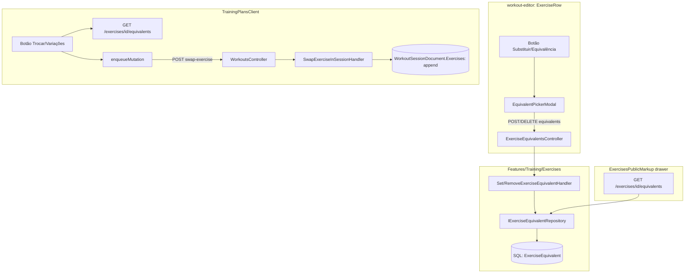

# Variações/Equivalências de Exercício — Design

**Spec**: `ShapeUpApi/.specs/features/exercise-variations/spec.md`
**Status**: Approved

**Escopo de Execute neste repo**: só metade **[Backend]** (EXVAR-01/02/03/09 persistência+API; EXVAR-06/07 swap endpoint; EXVAR-02 simetria). EXVAR-04/05/08 e UI de EXVAR-01/06 são handoff `ShapeUp-Web` (+ `exercise-detail-drawer`).
---

## Architecture Overview

Duas peças novas de dado + duas superfícies de UI que consomem a mesma relação:

1. **Backend**: uma tabela de junção self-referencing sobre `Exercise` (`ExerciseEquivalent`, SQL/EF Core, mesma store que já hospeda `Exercise`), com uma sub-feature nova dentro do vertical-slice já existente `Features/Training/Exercises` (não uma feature de topo, não dentro de `workout-editor` — ver Assumptions da spec). Simetria é uma decisão de **leitura**, não duas linhas: uma única linha por par (ordem canonicalizada), lida nos dois sentidos.
2. **Execução**: uma operação nova (`SwapExerciseInSession`) que acrescenta uma entrada a `WorkoutSessionDocument.Exercises` (lista já FLAT, sem mudança de schema no agregado) — reusa o mesmo padrão de mutação enfileirada (`enqueueMutation`) já usado por `state`/`cancel`.
3. **Frontend**: um componente de picker reusado em dois lugares — dentro de `ExerciseRow.jsx` (autoria, `workout-editor`) e num botão novo na tela de execução (`TrainingPlansClient.jsx`) — mais o drawer da Biblioteca (`ExercisesPublicMarkup.tsx`) passando a ler a relação real em vez do texto estático.



---

## Code Reuse Analysis

### Existing Components to Leverage

| Component | Location | How to Use |
|---|---|---|
| `Exercise` entity + `IExerciseRepository` | `Features/Training/Shared/Entities/Exercise.cs`, `Shared/Abstractions/IExerciseRepository.cs` | `ExerciseEquivalent` referencia `Exercise.Id` (FK dupla); mesma `TrainingDbContext` (EF Core), sem novo `DbContext` |
| Padrão de tabela de junção já usado no mesmo agregado | `ExerciseEquipment`, `ExerciseMuscleProfile` (`Exercise.cs`) | Mesmo padrão EF Core (`ICollection<T>` + entidade de junção), aplicado a uma relação self-referencing em vez de pra outra entidade |
| `CreateExerciseHandler.MapResponse` | `Features/Training/Exercises/CreateExercise/CreateExerciseHandler.cs:51-72` | Reusado sem alteração pra mapear cada equivalente retornado (mesmo `ExerciseResponse`, já tem nome/músculos/equipamento) |
| Capability `platform.exercises.manage` | `ExercisesController.cs:40,51,63` (`[Authorize(Policy = "capability:platform.exercises.manage")]`) | Mesma policy protege `POST/DELETE` de equivalência — nenhuma capability nova |
| `WorkoutSessionDocument.Exercises` (lista flat) + `ExecutedExerciseDocumentValueObject` | `Shared/Documents/WorkoutSessionDocument.cs`, `.../ValueObjects/ExecutedExerciseDocumentValueObject.cs` | Reusado tal como é — a troca só faz `Exercises.Add(new ExecutedExerciseDocumentValueObject {...})`, sem mudar o shape |
| `IWorkoutSessionRepository` | `Shared/Abstractions/IWorkoutSessionRepository.cs` | Reusado pra buscar/salvar a sessão na nova operação de troca |
| `ITrainingAccessPolicy` | Fase 1 (AD-005) | Mesma checagem de acesso (dono da sessão/profissional vinculado) já usada por `UpdateWorkoutExecutionState`, aplicada à troca |
| `enqueueMutation`/`mutationQueue.js` | `ShapeUp-Web/src/services/mutationQueue.js` | Reusado sem alteração — troca de exercício é só mais um `endpoint`/`method`/`body`/`dedupeKey` enfileirado |
| `ExerciseLibraryModal.jsx` | `ShapeUp-Web/src/components/ExerciseLibraryModal.jsx` | Base de UI pro novo `EquivalentPickerModal` (busca + seleção no catálogo) — adaptado pra seleção múltipla com músculo/equipamento visível, em vez de inserir na ficha |
| `state.inspect`/navegação de drawer | `ExercisesShell.tsx:47-51` (`inspect`) | Reusado pra "pular pro detalhe" de um equivalente a partir do drawer, sem novo mecanismo de navegação |
| `LanguageContext`/`t()` | Fase 1 | Novas chaves seguem paridade EN/PT-BR/ES já fechada |

### Integration Points

| System | Integration Method |
|---|---|
| `ExercisesController` | Ganha um sub-recurso novo: `GET/POST/DELETE /api/training/exercises/{exerciseId}/equivalents` |
| `WorkoutsController` (execução) | Ganha uma rota nova: `POST /api/training/workouts/{sessionId}/swap-exercise` |
| `TrainingDbContext` (EF Core, SQL) | Nova `DbSet<ExerciseEquivalent>` + configuração de chave composta/self-referencing |
| `WorkoutSessionDocument` (Mongo) | Sem mudança de schema — só uma nova entrada na lista já existente `Exercises` |

---

## Components

### Backend — `ExerciseEquivalent` (entidade nova)

- **Purpose**: Persistir o par simétrico de exercícios equivalentes
- **Location**: `Features/Training/Shared/Entities/ExerciseEquivalent.cs`
- **Interfaces**:
  - `ExerciseEquivalent { int ExerciseId; int EquivalentExerciseId; DateTime CreatedAtUtc }` — chave composta `(ExerciseId, EquivalentExerciseId)`, invariante de armazenamento `ExerciseId < EquivalentExerciseId` (canonicaliza o par, evita 2 linhas pro mesmo relacionamento)
- **Dependencies**: `Exercise` (dupla FK, `OnDelete: Cascade` — se um exercício é excluído, suas relações de equivalência somem junto, sem deixar linha órfã)
- **Reuses**: mesmo padrão de tabela de junção já usado por `ExerciseEquipment`

### Backend — `IExerciseEquivalentRepository` / `ExerciseEquivalentRepository`

- **Purpose**: Ler/escrever relações, sempre resolvendo a simetria na leitura (independente de qual lado do par foi consultado)
- **Location**: `Shared/Abstractions/IExerciseEquivalentRepository.cs`, `Infrastructure/Repositories/ExerciseEquivalentRepository.cs`
- **Interfaces**:
  - `Task<IReadOnlyList<Exercise>> GetEquivalentsAsync(int exerciseId, CancellationToken)` — consulta com `WHERE ExerciseId = @id OR EquivalentExerciseId = @id`, retorna o EXERCÍCIO DO OUTRO LADO do par em cada linha
  - `Task SetEquivalentAsync(int exerciseId, int otherExerciseId, CancellationToken)` — canonicaliza a ordem (`min`/`max` dos dois ids) antes de `INSERT ... ON CONFLICT DO NOTHING` (idempotente, EXVAR edge case "marcado 2x")
  - `Task RemoveEquivalentAsync(int exerciseId, int otherExerciseId, CancellationToken)` — canonicaliza a ordem, `DELETE` idempotente (no-op se não existia)
- **Dependencies**: `TrainingDbContext`
- **Reuses**: mesmo padrão `IExerciseRepository`/`ExerciseRepository` já usado (assinatura `Task<T>`/`CancellationToken`, mesmo estilo)

### Backend — `Set/RemoveExerciseEquivalentHandler` + `GetExerciseEquivalentsHandler`

- **Purpose**: Aplicar EXVAR-01/02/03/09 (marcar, simetria automática por construção do repositório, aviso de grupo muscular, remover)
- **Location**: `Features/Training/Exercises/ExerciseEquivalents/` (sub-feature nova, mesmo padrão de pasta que `CreateExercise`/`UpdateExercise`)
- **Interfaces**:
  - `SetExerciseEquivalentCommand(int ExerciseId, int EquivalentExerciseId)` → `SetExerciseEquivalentHandler.HandleAsync` — valida que `ExerciseId != EquivalentExerciseId` (EXVAR-01 AC6), que ambos existem (`TrainingErrors.ExerciseNotFound`), calcula `MuscleGroupOverlapWarning: bool` na resposta (não bloqueia, só informa — EXVAR-03) e delega ao repositório (que já resolve simetria)
  - `RemoveExerciseEquivalentCommand(int ExerciseId, int EquivalentExerciseId)` → `RemoveExerciseEquivalentHandler.HandleAsync`
  - `GetExerciseEquivalentsQuery(int ExerciseId)` → `GetExerciseEquivalentsHandler.HandleAsync` → `ExerciseResponse[]` (reusa `CreateExerciseHandler.MapResponse`)
- **Dependencies**: `IExerciseEquivalentRepository`, `IExerciseRepository`
- **Reuses**: `CreateExerciseHandler.MapResponse`, `TrainingErrors.ExerciseNotFound`, `Result<T>` (`Shared/Results`)

### Backend — `ExercisesController` (editado)

- **Purpose**: Expor o sub-recurso de equivalências
- **Location**: `Features/Training/Exercises/ExercisesController.cs`
- **Interfaces**:
  - `GET /api/training/exercises/{exerciseId}/equivalents` — sem `[Authorize]` extra (mesmo nível de leitura pública que `GetById`, qualquer usuário autenticado)
  - `POST /api/training/exercises/{exerciseId}/equivalents/{equivalentExerciseId}` — `[Authorize(Policy = "capability:platform.exercises.manage")]`
  - `DELETE /api/training/exercises/{exerciseId}/equivalents/{equivalentExerciseId}` — mesma policy
- **Dependencies**: handlers acima
- **Reuses**: mesmo padrão de método/policy já usado em `Create`/`Update`/`Delete` deste mesmo controller

### Backend — `SwapExerciseInSessionCommand`/`SwapExerciseInSessionHandler` (execução)

- **Purpose**: Aplicar EXVAR-06/07 — trocar exercício numa sessão ativa, preservando sets já logados do original
- **Location**: `Features/Training/Workouts/SwapExerciseInSession/`
- **Interfaces**:
  - `SwapExerciseInSessionCommand(string SessionId, int OriginalExerciseId, int NewExerciseId, WorkoutSetValueObject[] RetainedSetsForOriginal)`
  - **Por que `RetainedSetsForOriginal`**: `ExecutedSetDocumentValueObject` **não** tem flag `Completed`/`CompletedAtUtc` (WEV fechou sem esse campo — só `Repetitions`/`Load`/…). Conclusão de set continua conceito client-side. O servidor não consegue inferir “concluído” de forma confiável; o cliente envia explicitamente os sets a **manter** no original (os já concluídos). Sets omitidos são descartados da entrada do original na mesma operação atômica do append do substituto.
  - `SwapExerciseInSessionHandler.HandleAsync`:
    1. Busca sessão; 404 / forbidden via mesma checagem inline de `UpdateWorkoutExecutionState` (AD-005)
    2. 400 se `IsCompleted`/`IsCancelled`
    3. Valida que `NewExerciseId` é equivalente registrado de `OriginalExerciseId` — 400 se não
    4. Valida que `NewExerciseId` ainda não está em `session.Exercises` — 400 `TrainingErrors.ExerciseAlreadyInSession`
    5. Localiza entrada de `OriginalExerciseId`; **substitui** `Sets` por `RetainedSetsForOriginal` (mapeados como em UpdateState); se original não existir na sessão → 400
    6. Append `ExecutedExerciseDocumentValueObject { ExerciseId = NewExerciseId, ExerciseName, RequireRpe = false (default — substituto não herda RequireRpe do original; autor pode ajustar depois se necessário), Sets = [] }`
    7. Persiste via `UpdateAsync`/`UpdateStateAsync`
- **Dependencies**: `IWorkoutSessionRepository`, `IExerciseEquivalentRepository`, `IExerciseRepository`
- **Reuses**: mapeamento de set de `UpdateWorkoutExecutionStateHandler`

> **Nota RequireRpe**: snapshot do substituto nasce com `RequireRpe = false` (não estava no plano). Não herdar o flag do original evita exigir RPE num exercício que o plano nunca configurou assim.

### Backend — `WorkoutsController` (editado)

- **Purpose**: Expor a rota de troca
- **Location**: `Features/Training/Workouts/WorkoutsController.cs` (mesmo controller de `state`/`cancel`/`finish`)
- **Interfaces**: `POST /api/training/workouts/{sessionId}/swap-exercise`
- **Dependencies**: `SwapExerciseInSessionHandler`
- **Reuses**: mesma autorização inline (dentro do handler, AD-005) já usada pelas outras rotas de execução deste controller

### Frontend — `EquivalentPickerModal` (novo)

- **Purpose**: UI reusada em 2 lugares — marcar equivalentes na autoria (`ExerciseRow`) e escolher um equivalente na troca de execução (`TrainingPlansClient`)
- **Location**: `ShapeUp-Web/src/components/training/EquivalentPickerModal.jsx` (novo)
- **Interfaces**: `<EquivalentPickerModal exerciseId={id} mode={'author' | 'swap'} onConfirm={...} onClose={...} />`
  - `mode='author'`: multi-seleção, busca todo o catálogo (exceto o próprio), mostra estado pré-marcado (equivalentes já existentes), aviso de grupo muscular divergente por candidato
  - `mode='swap'`: seleção única, lista SÓ os equivalentes já registrados do exercício (via `GET .../equivalents`), sem busca livre (troca só entre equivalentes JÁ registrados, por design — EXVAR-06 AC3)
- **Dependencies**: `useTrainingApi` (novas funções, ver abaixo)
- **Reuses**: estrutura de busca/lista de `ExerciseLibraryModal.jsx` (adaptada, não duplicada do zero)

### Frontend — `ExerciseRow.jsx` (editado, autoria)

- **Purpose**: Adicionar o botão "Substituir/Equivalência" (hoje só desenhado no mockup, ausente no componente real) que abre o picker em `mode='author'`
- **Location**: `ShapeUp-Web/src/components/training/ExerciseRow.jsx:39-44` (mesmo bloco `su-ex-toggles` que já tem o botão de remover `×`)
- **Interfaces**: novo botão (ícone `cached`, `title="Substituir Exercício"`, mesmo texto do mockup) ao lado do `×` existente; abre `EquivalentPickerModal` passando `exercise.exerciseId`
- **Dependencies**: `EquivalentPickerModal`
- **Reuses**: JSX/estilo `su-icon-btn` já usado pelo botão `×` na mesma linha

### Frontend — `ExercisesPublicMarkup.tsx` (editado, drawer da Biblioteca)

- **Purpose**: Aplicar EXVAR-04/05 — trocar `drawerSubs` (texto estático) por lista real navegável
- **Location**: `ShapeUp-Web/src/pages/Dashboard/markup/ExercisesPublicMarkup.tsx:141` (remoção do texto fixo), `:416-421` (bloco `Substituições Mecânicas Equivalentes`, novo `.map` renderizando cada equivalente clicável)
- **Interfaces**: `state.active.equivalents: ExerciseRecord[]` novo campo em `ExerciseRecord`/`ExercisesShellState`; clique num item chama `state.inspect(equivalente, event)` (mesma função já existente)
- **Dependencies**: `ExercisesShell.tsx` (busca os equivalentes do exercício ativo)
- **Reuses**: `state.inspect` já existente, mesmo padrão de `ExerciseRow` (o item da lista de equivalentes é visualmente uma versão compacta da linha da lista principal)

### Frontend — `ExercisesShell.tsx` (editado)

- **Purpose**: Buscar os equivalentes do exercício selecionado quando o drawer abre
- **Location**: `ShapeUp-Web/src/pages/Dashboard/ExercisesShell.tsx:47-51` (`inspect`)
- **Interfaces**: `inspect` passa a disparar `getExerciseEquivalents(ex.id)` (novo) e populupdate `selected.equivalents` de forma assíncrona (estado local, sem bloquear a abertura do drawer)
- **Dependencies**: `useTrainingApi` (nova função `getExerciseEquivalents`)
- **Reuses**: mesmo padrão de fetch-on-demand já usado pelo restante do shell

### Frontend — `TrainingPlansClient.jsx` (editado, execução)

- **Purpose**: Aplicar EXVAR-06/07/08 — fluxo em 2 passos (escolher → trocar), só nesta sessão
- **Location**: próximo ao botão `client.session.card.details` já existente (linha ~1085 na região do cabeçalho do exercício em execução)
- **Interfaces**:
  1. Botão "Trocar exercício" / variações — **não** muta sozinho: só busca `getExerciseEquivalents(exercise.exerciseId)` e abre `EquivalentPickerModal mode='swap'`
  2. No **confirm** do picker (escolha explícita de 1 equivalente): `swapExercise(...)` atualiza estado local (mantém sets `completed` no original; remove não-concluídos; insere substituto com `sets: []`) + `enqueueMutation({ endpoint: .../swap-exercise, method: 'POST', body: { originalExerciseId, newExerciseId, retainedSetsForOriginal }, dedupeKey: \`workout-swap-${workoutSessionId}-${originalExerciseId}\` })`
  3. Plano prescrito permanece intacto — próxima sessão desse plano volta ao exercício original
- **Dependencies**: `EquivalentPickerModal`, `enqueueMutation` (já importado), `useTrainingApi`
- **Reuses**: mesmo padrão de `enqueueMutation` já usado pelas linhas 153/268/365/530/661 deste arquivo; mesmo padrão de estado local `exercises`/`exercisesRef` já existente

### Frontend — `useTrainingApi.js` (editado)

- **Purpose**: Novas funções de API pro front consumir
- **Location**: `ShapeUp-Web/src/hooks/api/useTrainingApi.js`
- **Interfaces**:
  - `getExerciseEquivalents(exerciseId)` → `GET /api/training/exercises/{exerciseId}/equivalents`
  - `setExerciseEquivalent(exerciseId, equivalentExerciseId)` → `POST .../equivalents/{equivalentExerciseId}`
  - `removeExerciseEquivalent(exerciseId, equivalentExerciseId)` → `DELETE .../equivalents/{equivalentExerciseId}`
- **Dependencies**: cliente HTTP já existente no hook
- **Reuses**: mesmo padrão das demais funções do hook (`getExercises`, etc.)

---

## Data Models

```typescript
// Backend (conceitual)
interface ExerciseEquivalent {
  exerciseId: number          // menor dos dois ids (canonicalização)
  equivalentExerciseId: number // maior dos dois ids
  createdAtUtc: string
}

// Resposta de GET .../equivalents — reusa o shape já existente
interface ExerciseResponse {
  id: number
  name: string
  namePt: string
  description?: string
  videoUrl?: string
  muscles: ExerciseMuscleValueObject[]
  equipments: ExerciseEquipmentValueObject[]
  steps: string[]
}

// Execução — sem novo tipo, só uma nova entrada na lista já existente
interface ExecutedExerciseDocumentValueObject {
  exerciseId: number
  exerciseName: string
  sets: ExecutedSetDocumentValueObject[] // vazia para o exercício substituto recém-inserido
}
```

**Relationships**: `ExerciseEquivalent` é uma tabela de junção pura sobre `Exercise` (SQL, `TrainingDbContext`), sem relação com `WorkoutPlanDocument`/`WorkoutSessionDocument` (Mongo) — a leitura na execução é só uma CONSULTA (`GetExerciseEquivalentsQuery`) no momento da troca, nunca uma referência persistida no documento de sessão. `WorkoutSessionDocument.Exercises` ganha mais uma entrada (mesmo tipo já existente), sem nenhum campo novo de "troca"/"substituído-de" — a proveniência (quem trocou por quem) fica só no evento/log da mutação, não no schema de sessão (ver Risks, linha de auditoria).

---

## Error Handling Strategy

| Error Scenario | Handling | User Impact |
|---|---|---|
| Marcar equivalência do exercício com ele mesmo | `400` via validator (`ExerciseId != EquivalentExerciseId`) | Picker impede a seleção do próprio exercício na busca (defesa em profundidade) |
| Exercício ou equivalente não existe | `404`/`400` `TrainingErrors.ExerciseNotFound` | Mensagem clara no picker |
| Usuário sem `platform.exercises.manage` tenta marcar/remover | `403` | Botão de autoria nem aparece pra quem não tem a capability (UI já esconde; backend reforça) |
| Trocar por exercício que já está na sessão | `400` `TrainingErrors.ExerciseAlreadyInSession` (novo) | Toast informando que o exercício já está no treino |
| Trocar por exercício que NÃO é equivalente registrado (payload adulterado) | `400` | Nunca deveria acontecer via UI normal (picker só lista equivalentes reais); defesa em profundidade no backend |
| Trocar numa sessão já finalizada/cancelada | `400` | Botão de troca já não aparece fora de sessão ativa; backend reforça |
| Rede offline no momento da troca | Mutação enfileirada normalmente (`enqueueMutation`), sem erro pro usuário | Mesmo indicador visual já existente (`OfflineQueueIndicator.jsx`) |

---

## Risks & Concerns

| Concern | Location | Impact | Mitigation |
|---|---|---|---|
| `ExerciseRow.jsx` hoje NÃO carrega `exercise.exerciseId`/id do catálogo de forma explícita no shape usado pelo componente (só `name`/`tags`/`notes`/`sets`) | `ShapeUp-Web/src/components/training/ExerciseRow.jsx:8-18`, `ShapeUp-Web/src/components/training/BlockCard.jsx` | Sem o id do catálogo disponível na linha, o botão de equivalência não sabe QUAL exercício autorar | Confirmar em Tasks o campo real de origem (`ExerciseLibraryModal` já seleciona por id — provavelmente `exercise.exerciseId` já existe upstream em `PlanEditor`/`BlockCard`, só não está no destructuring atual do componente) antes de implementar o botão; se não existir, é 1 prop a mais passada de `BlockCard`, não um redesenho |
| `WorkoutSessionDocument.Exercises` não tem campo `completed` no set — WEV confirmou e fechou sem introduzir esse campo | `ExecutedSetDocumentValueObject.cs` | Swap não pode “adivinhar” sets concluídos no servidor | **Resolvido**: comando carrega `RetainedSetsForOriginal`; cliente envia só os sets concluídos. Sem novo campo no documento |
| Nenhum teste de frontend cobre `TrainingPlansClient.jsx`/`ExerciseRow.jsx` hoje (mesmo gap já registrado no `workout-editor`) | `ShapeUp-Web/src` (ausência) | Novo botão + picker sem rede de segurança automatizada no frontend | Gap pré-existente, não introduzido por esta feature; backend ganha cobertura via unit/integration nas Tasks, mesmo padrão já aplicado em `workout-editor`/`nutrition` |
| `ExercisesController.GetAll`/`GetById` não tem paginação de equivalentes (se um exercício acumular centenas) | `GetExercisesHandler.cs` (padrão keyset já usado) | Baixo — nenhum cenário real do produto hoje sugere centenas de equivalentes por exercício | Sem mitigação nesta fase — mesma decisão já tomada na spec (Out of Scope: sem limite artificial); revisitar só se o dado real mostrar necessidade |

> Fora esses achados, nenhum risco de segurança/autorização novo — reusa a mesma capability (`platform.exercises.manage`) e a mesma política de acesso de execução (`ITrainingAccessPolicy`, AD-005) já existentes, sem superfície nova de autorização.

---

## Tech Decisions

| Decision | Choice | Rationale |
|---|---|---|
| Simetria implementada como 1 linha canonicalizada vs. 2 linhas independentes | 1 linha, ordem canonicalizada (`min`/`max` dos ids) | Elimina a possibilidade estrutural de A↔B divergir (A lista B mas B não lista A) — é invariante do armazenamento, não uma regra de aplicação que pode ser esquecida em algum call site novo (mesmo espírito do AD-007, "Intensity como objeto único torna a exclusividade invariante do tipo") |
| Troca de exercício na execução exige que o novo exercício já seja um equivalente REGISTRADO (não busca livre) | Restrito a equivalentes já cadastrados | Reflete a spec (EXVAR-06 AC3 implícito — picker de execução só lista equivalentes) — troca livre por qualquer exercício do catálogo durante a execução não foi pedida; qualquer necessidade real de "troca livre" é decisão de produto separada, não assumida aqui |
| Fluxo do swap na execução | **Não é instantâneo**: (1) aluno abre picker / lista de equivalentes do exercício atual; (2) **escolhe** uma variação/equivalente; (3) só então a sessão é mutada. Sem auto-swap no primeiro toque | Confirmação explícita do usuário (2026-09-17): escolha → troca. O botão só abre a escolha; a mutação `swap-exercise` roda no confirm |
| Escopo da troca | **Só a execução corrente** (`WorkoutSessionDocument`) — o `WorkoutPlanDocument` / template **não** muda. Próxima sessão desse plano volta ao exercício prescrito original | Pedido explícito: "troca no treino atual (para aquela execução)" — substituto é histórico da sessão, não reescrita do plano |
| `SwapExerciseInSessionCommand` como operação NOVA e dedicada, em vez de sobrecarregar `UpdateWorkoutExecutionStateCommand` existente | Operação dedicada | `UpdateWorkoutExecutionStateCommand` hoje só atualiza sets de exercícios JÁ presentes; misturar append estrutural deixaria o contrato ambíguo |
| Sets retidos na troca | Cliente envia `RetainedSetsForOriginal` no swap | Sem flag `completed` no documento (pós-WEV); única forma correta de aplicar EXVAR-07 no servidor |
| Onde a feature vive no backend | Sub-feature em `Exercises` (catálogo) + `Workouts` (swap) — sem feature de topo nova | Mesmo racional AD-002: reusar vertical-slices donos do dado |

> **Project-level**: nenhuma decisão aqui contradiz ou substitui um `AD-NNN` ativo em `.specs/STATE.md`. `AD-007` (Block só em planejamento) permanece intocado — `SwapExerciseInSessionCommand` não introduz Block em Execução, só acrescenta uma entrada à lista flat já existente.

---

## Tips (não editar — referência do processo)

- Confirmar este design antes de ir pra Tasks (fora do escopo deste pedido — Tasks não é executado aqui).
