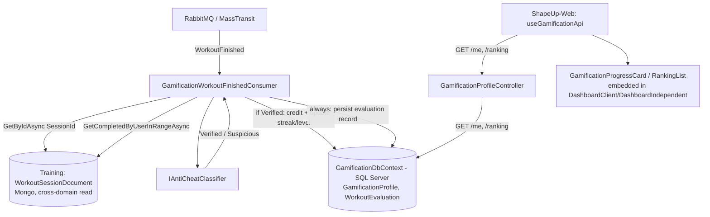

# Gamification — Design

**Spec**: `ShapeUpApi/.specs/features/gamification/spec.md`
**Status**: Draft

---

## Architecture Overview

`Gamification` is a new vertical-slice domain (SQL Server, EF Core — per AGENTS.md/user decision), triggered by the already-implemented `event-bus` feature. It replaces the proof-of-concept `WorkoutFinishedConsumer` (Training) with a real consumer that classifies the session (anti-cheat) BEFORE crediting anything, then updates streak/level/coins and persists an evaluation record (audit trail + duplicate-detection lookup + idempotency safety net beyond the bus's own guarantee).



---

## Code Reuse Analysis

### Existing Components to Leverage

| Component | Location | How to Use |
|---|---|---|
| `WorkoutFinished` event (already shipped) | `Features/Training/Shared/Events/WorkoutFinished.cs` | Consumed as-is (`SessionId`, `TargetUserId`, `ExecutedByUserId`, `EndedAtUtc`) — no change to the event contract |
| `IWorkoutSessionRepository.GetByIdAsync` | `Features/Training/Shared/Abstractions/` | Fetches full session detail (duration, exercises/sets) the event itself doesn't carry — same cross-domain-read pattern already used by `TrainerClientAdherenceCalculator` (GymManagement reading Training's Mongo documents directly) |
| `IWorkoutSessionRepository.GetCompletedByUserInRangeAsync` | same | Already used by `FinishWorkoutExecutionHandler` for PR calculation — reused here for both the volume-baseline (last N sessions) and duplicate-session lookup (recent sessions in a time window) |
| `MessagingExtensions.cs` (`bus.AddConsumer<...>`) | `Configurations/MessagingExtensions.cs` | Add `bus.AddConsumer<GamificationWorkoutFinishedConsumer>()` alongside (or replacing) the PoC `WorkoutFinishedConsumer` registration |
| `GymManagementDbContext` pattern (EF Core, Fluent config, `Features/{Domain}/Infrastructure/Data/`) | `Features/GymManagement/Infrastructure/Data/GymManagementDbContext.cs` | Template for `GamificationDbContext` — same conventions (Fluent `OnModelCreating`, `DbSet<T>` per entity) |
| Keyset pagination pattern (AGENTS.md mandatory) | existing paginated endpoints across the API | Reused for the ranking endpoint (`cursor`/`pageSize`, opaque cursor, no offset/skip) |
| ResultPattern / CQRS command-handler convention | every existing `Features/{Domain}/{Feature}/` | `GetGamificationProfile` (query) and `GetRanking` (query) follow the same handler/controller shape as every other read endpoint |

### Integration Points

| System | Integration Method |
|---|---|
| `event-bus` (MassTransit) | New consumer registered in the existing `AddMessaging` extension; PoC `WorkoutFinishedConsumer` removed (its job is now done for real) |
| `Training` (Mongo, cross-domain read-only) | `IWorkoutSessionRepository` injected into the new consumer — read-only, no write coupling |
| SQL Server | New `GamificationDbContext` + EF Core migration, following the exact pattern of `GymManagementDbContext`/`AuthorizationDbContext` |

---

## Components

### `IAntiCheatClassifier` / `AntiCheatClassifier`

- **Purpose**: Apply the 3 in-scope rules (impossible activity, duplication, abnormal volume) — each rule votes a full `ActivityClassification` (graded, not binary) — and combine the 3 votes into one final classification via "worst wins"
- **Location**: `Features/Gamification/Shared/AntiCheat/IAntiCheatClassifier.cs` + `AntiCheatClassifier.cs`
- **Interfaces**:
  - `Task<AntiCheatResult> ClassifyAsync(WorkoutSessionDocument session, IReadOnlyList<WorkoutSessionDocument> recentSessions, CancellationToken ct)` → `AntiCheatResult(ActivityClassification Classification, string? Reason)` — `Reason` names whichever rule produced the worst (winning) vote
  - Internally, 3 private rule methods each return `(ActivityClassification Vote, string Reason)`: `ClassifyDuration` (ratio-based, see spec GAM-03 AC1), `ClassifyDuplication` (exact/partial/no-match, see AC2), `ClassifyVolume` (baseline-relative, see AC3) — kept separate methods specifically so each is independently unit-testable against its own threshold table (1:1 to the spec's per-rule AC), not just the aggregate outcome
  - Aggregation: `new[] { durationVote, duplicationVote, volumeVote }.OrderByDescending(v => Severity(v)).First()` where `Severity(Invalid) > Severity(Suspicious) > Severity(LikelyValid) > Severity(Verified)`
- **Dependencies**: none beyond the data passed in (pure function over session + recent-sessions history — no I/O of its own, keeps it unit-testable without mocking a repository)
- **Reuses**: nothing — new, but designed to be a pure function so every rule's threshold table is independently unit-testable

### `ActivityClassification` (enum)

- **Purpose**: The 4-value vocabulary from the roadmap
- **Location**: `Features/Gamification/Shared/Enums/ActivityClassification.cs`
- **Interfaces**: `enum ActivityClassification { Verified, LikelyValid, Suspicious, Invalid }`
- **Dependencies**: none
- **Reuses**: nothing — see Risks & Concerns: only `Verified`/`Suspicious` are actually produced by this feature's concrete rules; `LikelyValid`/`Invalid` exist in the enum for roadmap-vocabulary completeness and future rules, not exercised by any test here

### `GamificationWorkoutFinishedConsumer`

- **Purpose**: The real consumer — classify, then (if clean) credit XP/coins and update streak/level/milestones; always persist the evaluation
- **Location**: `Features/Gamification/WorkoutFinished/GamificationWorkoutFinishedConsumer.cs`
- **Interfaces**: `class GamificationWorkoutFinishedConsumer : IConsumer<WorkoutFinished>`
- **Dependencies**: `IWorkoutSessionRepository` (Training), `IAntiCheatClassifier`, `GamificationDbContext`
- **Reuses**: `WorkoutFinished` event, `IWorkoutSessionRepository`'s existing query methods

### `GamificationDbContext` + entities

- **Purpose**: Persist per-user gamification state and the evaluation audit trail
- **Location**: `Features/Gamification/Infrastructure/Data/GamificationDbContext.cs`, `Features/Gamification/Shared/Entities/{GamificationProfile,WorkoutEvaluation}.cs`
- **Interfaces**: `DbSet<GamificationProfile> Profiles`, `DbSet<WorkoutEvaluation> Evaluations`
- **Dependencies**: EF Core / SQL Server (`ConnectionStrings:DefaultConnection`, same server as other SQL domains)
- **Reuses**: `GymManagementDbContext`'s Fluent-config style

### `GetGamificationProfileHandler` / `GamificationProfileController`

- **Purpose**: `GET /api/gamification/me` — read the caller's own profile (XP, level, streak, coins, ShapeScore, last-evaluation "what changed" signal)
- **Location**: `Features/Gamification/GetGamificationProfile/`
- **Interfaces**: query handler + controller, same CQRS shape as every other read endpoint
- **Dependencies**: `GamificationDbContext`
- **Reuses**: existing controller/handler conventions, `ResultPattern`

### `GetRankingHandler` / `RankingController`

- **Purpose**: `GET /api/gamification/ranking?cursor=&pageSize=` — global leaderboard by ShapeScore desc
- **Location**: `Features/Gamification/GetRanking/`
- **Interfaces**: query handler + controller, keyset-paginated
- **Dependencies**: `GamificationDbContext`
- **Reuses**: existing keyset-pagination convention (AGENTS.md mandatory — no offset/skip)

### `ShapeScoreCalculator`

- **Purpose**: Compute the v1 ShapeScore (average of 4 sub-scores over a rolling 30-day window)
- **Location**: `Features/Gamification/Shared/ShapeScoreCalculator.cs`
- **Interfaces**: `Task<int> CalculateAsync(int userId, CancellationToken ct)` → 0–100
- **Dependencies**: `GamificationDbContext` (own evaluation history), `IWorkoutSessionRepository` (Training, for the "Evolução"/PR-in-period sub-score and "Metas"/weekly-target sub-score)
- **Reuses**: `WorkoutPrDocumentValueObject` (Training) for the Evolução sub-score, `SessionsTargetPerWeek` concept (Training dashboard) for the Metas sub-score

### `useGamificationApi` (frontend hook)

- **Purpose**: Call the 2 new endpoints (`GET /me`, `GET /ranking`) the same way every other domain hook does
- **Location**: `ShapeUp-Web/src/hooks/api/useGamificationApi.js` (new)
- **Interfaces**: `getGamificationProfile()`, `getRanking(cursor, pageSize)` — same `apiClient`-based shape as `useTrainingApi.js`
- **Dependencies**: `apiClient` (existing)
- **Reuses**: `useTrainingApi.js`'s exact structure (`useCallback` per method, passthrough body)

### `GamificationProgressCard` (frontend component)

- **Purpose**: Show XP/level-progress, streak, ShapeCoins, ShapeScore — embedded into `DashboardClient.jsx` and `DashboardIndependent.jsx`, alongside (not replacing) the existing Training-streak metric card
- **Location**: `ShapeUp-Web/src/components/gamification/GamificationProgressCard.jsx` (new)
- **Interfaces**: `<GamificationProgressCard profile={profile} />` — presentational, data fetched by the parent dashboard page via `useGamificationApi`
- **Dependencies**: `Card` (existing shared component), a `lucide-react` icon distinct from `Flame` (already used by Training's own streak card) — e.g. `Zap`/`Trophy` for XP/level, keep `Flame` visually reserved for Training's existing streak so the two concepts stay visually distinguishable per spec's Assumptions
- **Reuses**: existing `Card`/metric-card CSS classes (`su-metric-card` family) — no new UI library, per spec GAM-12 AC2

### `RankingList` (frontend component)

- **Purpose**: Global ranking, paginated, own position highlighted if present on the current page
- **Location**: `ShapeUp-Web/src/components/gamification/RankingList.jsx` (new) — embedded wherever the product wants it surfaced (a dashboard section, following the same "no new page" simplicity as the progress card, unless a dedicated route is preferred — left as an Execute-time call given no existing "ranking" route/nav-entry precedent to follow)
- **Interfaces**: `<RankingList entries={entries} currentUserId={id} onLoadMore={...} />`
- **Dependencies**: `Card`, existing cursor-pagination UI pattern (if one already exists in the codebase — reused; else a simple "load more" button, kept minimal per YAGNI)
- **Reuses**: keyset-pagination consumption pattern already used by other paginated lists in `ShapeUp-Web`

---

## Data Models

```csharp
// Features/Gamification/Shared/Entities/GamificationProfile.cs
public class GamificationProfile
{
    public int UserId { get; set; }              // PK - same identity as the domain user, no surrogate key needed (1:1)
    public int TotalXp { get; set; }
    public int Level { get; set; }                // derived (TotalXp/500)+1, but stored for cheap reads/ranking-adjacent queries
    public int CurrentStreak { get; set; }
    public DateTime? LastActivityDateUtc { get; set; }   // DATE granularity (UTC) - drives streak increment/reset logic
    public int ShapeCoins { get; set; }
    public int LastStreakMilestoneAwarded { get; set; }  // highest 7-multiple already paid; prevents double-award on re-evaluation
    // "what changed last time" snapshot (spec GAM-11 - the future-achievement/animation signal)
    public bool LastEvaluationLeveledUp { get; set; }
    public int? LastEvaluationLevelFrom { get; set; }
    public int? LastEvaluationLevelTo { get; set; }
    public bool LastEvaluationStreakMilestoneHit { get; set; }
    public int? LastEvaluationStreakMilestoneValue { get; set; }
    public DateTime UpdatedAtUtc { get; set; }
}

// Features/Gamification/Shared/Entities/WorkoutEvaluation.cs
public class WorkoutEvaluation
{
    public string SessionId { get; set; } = null!;  // PK - Training's Mongo ObjectId string; also the idempotency key
    public int UserId { get; set; }
    public ActivityClassification Classification { get; set; }
    public string? Reason { get; set; }              // which rule fired, if any (null when Verified)
    public bool CreditGranted { get; set; }
    public DateTime EvaluatedAtUtc { get; set; }
}
```

**Relationships**: `WorkoutEvaluation.UserId` → `GamificationProfile.UserId` (no formal FK across the two purposes they serve — `WorkoutEvaluation` is an append-only audit/lookup log, `GamificationProfile` is the current-state row updated in place). `WorkoutEvaluation.SessionId` has no FK to Training's Mongo `WorkoutSessionDocument` (different database technology — referential integrity is conventional, not enforced by the database).

---

## Error Handling Strategy

| Error Scenario | Handling | User Impact |
|---|---|---|
| `WorkoutFinished` consumed for a `SessionId` already in `WorkoutEvaluation` | Consumer short-circuits (no-op, no re-credit) — belt-and-suspenders idempotency beyond the bus's own dedup | None; effect applied once |
| `IWorkoutSessionRepository.GetByIdAsync` returns null (session not found — shouldn't happen, but Mongo is eventually-consistent-adjacent across the outbox delay window) | Retry via the bus's normal consumer-retry middleware (transient — the session write and the event publish are in the same transaction, so this should self-resolve on redelivery) | None visible; resolved by existing retry machinery from `event-bus` |
| SQL Server unavailable when persisting `GamificationProfile`/`WorkoutEvaluation` | Consumer throws, MassTransit's retry+dead-letter (already built) handles it — same as any other consumer failure | None visible to the workout-finish API caller (already decoupled by the bus) |
| Ranking/profile read when `GamificationProfile` doesn't exist yet for a user | Returns a zeroed profile (XP 0, level 1, streak 0, coins 0, ShapeScore 0) — never a 404/error for "no history yet" | Clean UX for brand-new users |

---

## Risks & Concerns

| Concern | Location | Impact | Mitigation |
|---|---|---|---|
| Each of the 3 rules now votes a graded 4-way outcome instead of binary pass/fail — more threshold constants to tune, more branches to test | `AntiCheatClassifier`'s 3 rule methods | More surface for an off-by-one in a threshold (e.g. `3x` vs `6x` boundary) to slip through unnoticed | Each rule's threshold table gets its own dedicated unit tests at every boundary (e.g. `r=0.29` vs `r=0.3` vs `r=0.31`) per the Test Coverage Matrix in tasks.md — boundaries are exactly where a graded rule is most likely to have an off-by-one |
| Anti-cheat's duplicate-check and volume-baseline both call `IWorkoutSessionRepository.GetCompletedByUserInRangeAsync` — cross-domain read coupling from `Gamification` into `Training`'s Mongo repository | `GamificationWorkoutFinishedConsumer` | If Training's repository shape changes, Gamification breaks silently (no compile-time domain boundary enforcing this is stable) | Accepted — same pattern already exists in the codebase today (`TrainerClientAdherenceCalculator`), not a new category of coupling introduced by this feature |
| `WorkoutEvaluation` keyed by `SessionId` (Mongo ObjectId string) with no FK to Training's actual document | Data Models | Referential integrity is conventional only — an orphaned `WorkoutEvaluation` row (Training session later deleted, if that ever becomes possible) has no DB-level cleanup | Accepted for v1 — no session-deletion feature exists in Training today; revisit if one is ever added |
| `ShapeScoreCalculator`'s "Evolução" sub-score (new PR in period) and "Metas" sub-score (weekly target hit) both read Training data live on every ranking/profile request — no caching | `ShapeScoreCalculator` | Ranking endpoint could get slow if computed on-the-fly per user, per request, at scale | Acceptable for v1 (no current traffic to justify pre-computation); a future optimization would recompute ShapeScore once per evaluation (write-time) instead of read-time — flagged, not built, since no performance problem exists yet to justify it (YAGNI) |
| Gamification is a NEW SQL Server domain — first migration for it | `GamificationDbContext` | Standard EF Core migration risk (same as any new domain) | No special risk beyond the norm; follows `GymManagementDbContext`'s already-proven pattern |

---

## Tech Decisions

| Decision | Choice | Rationale |
|---|---|---|
| Cross-domain read into Training instead of enriching the `WorkoutFinished` event | Consumer calls `IWorkoutSessionRepository` directly | Matches existing precedent in the codebase (`TrainerClientAdherenceCalculator`); avoids reopening the already-shipped, already-verified `event-bus` feature just to widen its one event's payload |
| `AntiCheatClassifier` takes data in, returns a verdict — no I/O of its own | Pure function/service | Keeps the 3 anti-cheat rules independently unit-testable (1:1 to spec ACs) without mocking a repository in every rule test |
| `WorkoutEvaluation` as an append-only audit table, not just an in-memory check | Persisted row per evaluated session | Satisfies spec's "classificação consultável" AC AND gives a real idempotency safety net AND is the lookup source for the duplicate-detection rule — three requirements served by one simple table |
| ShapeScore computed at read-time (v1), not cached/precomputed | Read-time calculation | Simplest correct thing that works today; precomputation is flagged as a future optimization, not built without a real performance problem motivating it (YAGNI) |
| Achievement/animation "what changed" signal lives on `GamificationProfile` as plain columns, not a separate events table | `LastEvaluationLeveledUp` etc. as columns | Minimal viable signal per the user's explicit ask (don't build the achievement engine now, just don't throw away the diff) — a dedicated append-only "notable events" table would be the natural next step when the achievement-engine phase actually gets specified, not invented speculatively now |

> **Project-level**: "achievements/badges are deferred to a dedicated future phase with a dynamic, data-driven rule engine (no redeploy to add one)" and "gamification evaluations expose a minimal 'what changed' signal so that future phase and celebratory frontend UI don't require a redesign of this feature's core" are conventions that phase should follow — recorded as `AD-011` in `ShapeUpApi/.specs/STATE.md`.

---

## Tips (não editar — referência do processo)

- Confirmar este design antes de ir pra Tasks.
</content>
