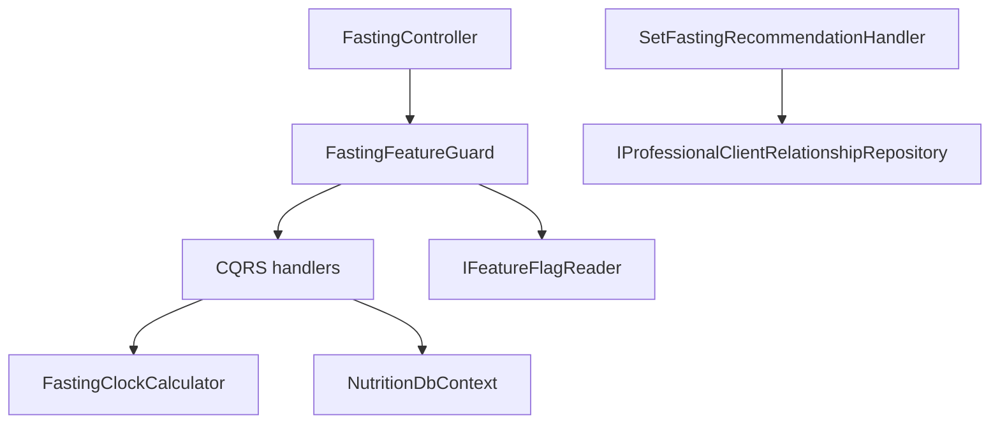

# Intermittent Fasting Timer (API) Design

**Spec**: `.specs/features/intermittent-fasting-timer/spec.md`
**Status**: Approved for Execute (user: implement API with sub-agents)
**Sister**: ShapeUp-Web `IFTW-*` (not this repo)

---

## Architecture Overview

Add a Fasting vertical slice under existing Nutrition. Persist **one agenda row per user** and **override rows** in SQL (`NutritionDbContext`) — same store as `NutritionProfile` / diary (high-write, current-state). Do **not** add Mongo. Do **not** add a repository interface for one DbContext (Profile handlers already use `NutritionDbContext` directly).

`GET /api/nutrition/fasting` is the only read the Web needs: it returns agenda, recommendation, active override, and a **computed** `clock` (`status`, `boundaryAt`, `source`). Agenda Fasting/Eating is derived in `FastingClockCalculator` from protocol hours + `eatingStartMinutes` + IANA zone + `utcNow`. Override wins until `eatEndsAt`; if `eatEndsAt <= utcNow`, the handler marks the override completed (lazy) then derives from agenda.



P1 routes are self (`GetUserId()`). P2 recommendation uses `GetActiveAsync(pro, client, "Training")` — that is the relationship type already used in production; no new `Nutrition` relationship type.

---

## Code Reuse Analysis

### Existing Components to Leverage

| Component | Location | How to Use |
| --- | --- | --- |
| `NutritionDbContext` | `Features/Nutrition/Infrastructure/Data/` | New `DbSet`s + `OnModelCreating` + EF migration |
| `NutritionModule` | `Features/Nutrition/NutritionModule.cs` | Register handlers, validators, `IUtcClock` |
| `IFeatureFlagReader` | `PlatformFeatureFlags` | Guard; missing key already means enabled |
| `CommonErrors` / `Result` / `ToActionResult` | `Shared/Results` | 400/401/403/409; custom `Error` code for flag 404 |
| `IProfessionalClientRelationshipRepository` | `Features/Relationships` | P2 403 vs save |
| `NutritionProfileController` | self `GetUserId()` | Copy auth wiring |
| FluentValidation + handler tests | `tests/UnitTests/Domains/Nutrition/` | Same xunit + fake clock |
| Integration host | `NutritionProfileEndpointsIntegrationTests` | Copy SQL collection + seed user |
| Feature flag HasData | `PlatformFeatureFlags` InitialCreate | Second seed row via new migration |

### Integration Points

| System | Method |
| --- | --- |
| SQL Server | Nutrition migration: `NutritionFastingAgendas`, `NutritionFastingOverrides` |
| Platform flags | Migration insert `nutrition.intermittent-fasting` enabled=true |
| Relationships | Training-type active link for P2 |
| Web | JSON camelCase snapshot; no ticks on server |

---

## Components

### FastingClockCalculator

- **Purpose**: Pure derivation of Fasting/Eating/`boundaryAt` from agenda + utcNow; override remaining time.
- **Location**: `src/Features/Nutrition/Fasting/Shared/FastingClockCalculator.cs`
- **Interfaces**: static or instance methods `FromAgenda(...)`, `FromOverride(...)` — no I/O.
- **Dependencies**: `TimeZoneInfo`.
- **Reuses**: BCL only.

### IUtcClock / SystemUtcClock

- **Purpose**: Inject `UtcNow` so GET/Start tests freeze time (no TimeProvider package in UnitTests today).
- **Location**: `src/Features/Nutrition/Fasting/Shared/IUtcClock.cs`
- **Dependencies**: none.

### FastingFeatureGuard

- **Purpose**: If `IFeatureFlagReader.IsEnabledAsync("nutrition.intermittent-fasting")` is false, return `Error("nutrition.fasting.disabled", ..., 404)`.
- **Location**: `src/Features/Nutrition/Fasting/Shared/FastingFeatureGuard.cs`
- **Reuses**: `IFeatureFlagReader` (missing key = enabled, existing reader behavior).

### Handlers (CQRS)

| Handler | HTTP | Spec |
| --- | --- | --- |
| `PutFastingAgendaHandler` | `PUT /api/nutrition/fasting/agenda` | IFTA-01, IFTA-07 |
| `GetFastingClockHandler` | `GET /api/nutrition/fasting` | IFTA-02 |
| `StartFastingOverrideHandler` | `POST /api/nutrition/fasting/override/start` | IFTA-03 |
| `EndFastingOverrideEarlyHandler` | `POST /api/nutrition/fasting/override/end-early` | IFTA-04 |
| `CancelFastingOverrideHandler` | `POST /api/nutrition/fasting/override/cancel` | IFTA-04 |
| `SetFastingRecommendationHandler` | `PUT /api/nutrition/fasting/recommendation/{clientUserId}` | IFTA-06 |
| `GetFastingHistoryHandler` | `GET /api/nutrition/fasting/history` | IFTA-08 |

Each: FluentValidation when there is a body; `Result<T>`; `CancellationToken`; no exceptions for domain errors.

### FastingController

- **Purpose**: Thin map to handlers + feature guard + `ToActionResult`.
- **Location**: `src/Features/Nutrition/Fasting/FastingController.cs`
- **Start success**: 201.

---

## Data Models

### FastingAgenda (SQL, PK UserId)

```csharp
public class FastingAgenda
{
    public int UserId { get; set; }
    public int FastHours { get; set; }          // 14/16/18/20 P1; 12–23 P2
    public int EatHours { get; set; }           // 24 - FastHours
    public string Protocol { get; set; }        // "16:8" or "custom"
    public int EatingStartMinutes { get; set; } // 0..1410 step 30
    public string TimeZone { get; set; }        // IANA
    public int? RecommendedFastHours { get; set; }
    public string? RecommendedProtocol { get; set; }
    public DateTime UpdatedAtUtc { get; set; }
}
```

Recommendation lives on the **client's** agenda row (nullable). PUT recommendation upserts the row without requiring the client to have saved an eating window yet (`EatingStartMinutes` default 720 if creating shell — **no**: empty agenda must still GET Idle. Store recommendation on the same table with `FastHours` nullable until the athlete PUTs agenda.

Revised:

- `FastHours`/`EatHours`/`EatingStartMinutes`/`TimeZone` **nullable** until athlete saves agenda.
- `HasAgenda` = `FastHours != null`.
- Recommendation columns nullable independently.

### FastingOverride (SQL)

```csharp
public class FastingOverride
{
    public Guid Id { get; set; }
    public int UserId { get; set; }
    public string Status { get; set; } // Fasting | Eating | Completed | Cancelled
    public string Protocol { get; set; }
    public int FastHours { get; set; }
    public int EatHours { get; set; }
    public DateTime StartedAtUtc { get; set; }
    public DateTime FastEndsAtUtc { get; set; }
    public DateTime? EatEndsAtUtc { get; set; }
    public DateTime? CompletedAtUtc { get; set; }
}
```

Filtered unique index: at most one row per user where `Status` in (`Fasting`,`Eating`).

**Relationships**: Agenda 1:1 user. Override N per user, 0–1 active.

### Clock DTO

```csharp
public record FastingClockDto(string Status, DateTime? BoundaryAt, string? Source);
public record FastingSnapshotResponse(
    FastingAgendaDto? Agenda,
    FastingOverrideDto? Override,
    FastingRecommendationDto? Recommendation,
    FastingClockDto Clock);
```

`Idle` + nulls when no agenda and no active override.

History: `items` + `nextCursor` (keyset on `CompletedAtUtc` desc, `Id`), `pageSize` default/max 14.

---

## Error Handling Strategy

| Scenario | Handling | HTTP |
| --- | --- | --- |
| Invalid protocol / minutes / TZ / fastHours | FluentValidation → `CommonErrors.Validation` naming field | 400 |
| Start without agenda | Validation/domain | 400 |
| Duplicate Start / end-early on Eating / cancel with no active | `CommonErrors.Conflict` | 409 |
| Flag off | `nutrition.fasting.disabled` | 404 |
| No relationship P2 | `CommonErrors.Forbidden` | 403 |
| Unauthenticated | existing auth middleware | 401 |
| Invalid IANA | 400 `timeZone` | 400 |

---

## Risks & Concerns

| Concern | Location | Impact | Mitigation |
| --- | --- | --- | --- |
| Integration suite Mongo Testcontainers often blocked locally | `tests/IntegrationTests/README.md` / STATE | T12 may not run locally | Unit tests own ACs; integration still written; worker records skip if host cannot start |
| `FeatureFlagReader` treats missing key as **enabled** | `FeatureFlagReader.cs:14` | Seed required for admin toggle list, not for default-on | Seed migration T4 |
| DST / invalid local time | `TimeZoneInfo` | Wrong `boundaryAt` | Calculator tests with a DST zone; use `TimeZoneInfo.ConvertTime` + adjustment rules |
| AGENTS.md keyset pagination vs spec “up to 14” | history GET | Offset forbidden | Keyset, pageSize≤14 |
| Nutrition ARCHITECTURE.md stale | `ARCHITECTURE.md` | Agents drift | Update in controller task |

---

## Tech Decisions

| Decision | Choice | Rationale |
| --- | --- | --- |
| Store | SQL Nutrition, not Mongo | Current-state, tiny volume, Profile precedent (AD-013 high-write SQL) |
| No IFastingRepository | Handlers + DbContext | One implementation; Profile already skips the extra interface |
| Clock | Pure calculator + `IUtcClock` | Test freeze without new NuGet |
| P2 relationship type | `"Training"` | Only type `GetActiveAsync` is used with today |
| Lazy complete | GET and Start persist `Completed` when `eatEndsAt` passed | Spec IFTA-02 AC2 |
| Flag 404 code | exact `nutrition.fasting.disabled` | Spec IFTA-05; not `not_found` |
| Custom protocol | `Protocol = "custom"` + FastHours | IFTA-07 |

No new project-level AD — stays inside Nutrition.
