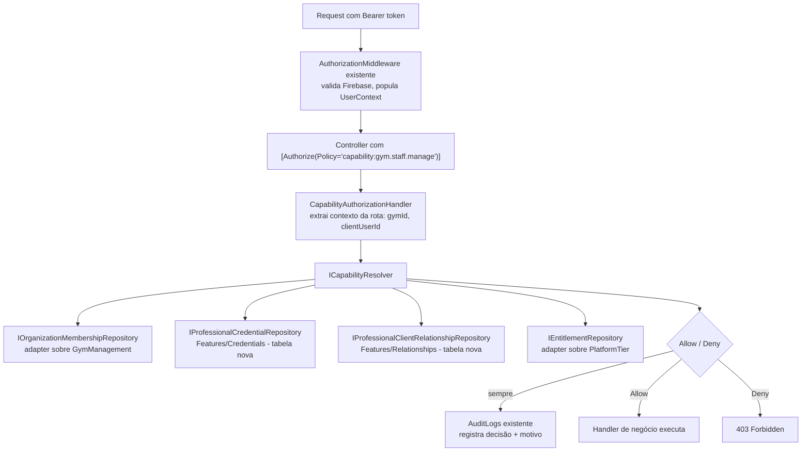

# Native Authorization Model Design

**Spec**: `.specs/features/native-authorization-model/spec.md`
**Status**: Approved (arquitetura confirmada com usuário — ver `STATE.md` AD-001/AD-002)

---

## Architecture Overview

Quatro Features novas vertical-slice (`Credentials`, `Relationships`, `Memberships`, `Entitlements`) + um resolver central em `Features/Authorization/Resolver` que implementa autorização nativa do ASP.NET Core (Policy-based), substituindo `RequireScopesAttribute`. `AuthorizationMiddleware` continua validando o token Firebase e populando `UserContext` — isso não muda (Firebase Auth intocado).



---

## Code Reuse Analysis

### Existing Components to Leverage

| Component | Location | How to Use |
|---|---|---|
| `AuthorizationMiddleware` | `Features/Authorization/Infrastructure/Authorization/AuthorizationMiddleware.cs` | Mantido sem mudança — continua validando Firebase e criando `UserContext`; só deixa de popular `Scopes` de `Group/Scope` (P3) |
| `Gym`, `GymStaff`, `GymStaffRole` | `Features/GymManagement/Shared/Entities/*` | `IOrganizationMembershipRepository` (novo) lê estes diretamente — sem migrar dado, sem nova tabela |
| `PlatformTier`, `UserPlatformRole` | `Features/GymManagement/Shared/Entities/*` | `IEntitlementRepository` (novo) deriva capabilities do tier atribuído, sem tabela nova |
| `AuditLogs` + `AuditLoggingMiddleware` | `Features/AuditLogs/*` | Reusado para logar toda decisão allow/deny do `CapabilityAuthorizationHandler` (AC AUTHZ-06) |
| `IUserRepository`, `IFirebaseService` | `Features/Authorization/Shared/*` | Reusados sem mudança pela middleware |
| Padrão vertical-slice (Command/Query + Handler + Controller) | `Features/GymManagement/*`, `Features/Training/*` | Aplicado igualmente às Features novas (`Credentials`, `Relationships`) |

### Integration Points

| System | Integration Method |
|---|---|
| ASP.NET Core Authorization | `services.AddAuthorization(options => options.AddPolicy("capability:...", ...))` registrado em `DependencyInjectionExtensions.cs`, uma policy por capability string usada nos controllers |
| SQL Server (`GymManagementDbContext`) | Lido via interfaces existentes (`IGymRepository`, `IGymStaffRepository`) pelo adapter de `Memberships`/`Entitlements` — sem novo `DbContext` para esses dois |
| SQL Server (novo) | `Credentials` e `Relationships` recebem `DbContext` próprio (`CredentialsDbContext`, `RelationshipsDbContext`), seguindo o padrão de `AuditLogsDbContext` isolado |

---

## Components

### `CapabilityRequirement`

- **Purpose**: Carrega o nome da capability exigida pelo endpoint (ex.: `gym.staff.manage`)
- **Location**: `Features/Authorization/Resolver/CapabilityRequirement.cs`
- **Interfaces**: `CapabilityRequirement(string capability)` — implementa `IAuthorizationRequirement`
- **Dependencies**: nenhuma
- **Reuses**: nada — tipo novo, pequeno

### `CapabilityAuthorizationHandler`

- **Purpose**: Ponto de entrada nativo do ASP.NET Core — extrai contexto da rota (`gymId`, `clientUserId` etc. de `HttpContext.GetRouteValue`), chama o resolver, decide `Succeed`/`Fail`, loga a decisão
- **Location**: `Features/Authorization/Resolver/CapabilityAuthorizationHandler.cs`
- **Interfaces**: `HandleRequirementAsync(AuthorizationHandlerContext context, CapabilityRequirement requirement): Task`
- **Dependencies**: `ICapabilityResolver`, `IAuditLogWriter` (ou repositório de audit existente)
- **Reuses**: `UserContext` já populado por `AuthorizationMiddleware` (lido de `HttpContext.Items`)

### `ICapabilityResolver` / `CapabilityResolver`

- **Purpose**: Núcleo da resolução — combina membership + credencial + relacionamento + entitlement para decidir se `(user, capability, context)` é permitido
- **Location**: `Features/Authorization/Resolver/CapabilityResolver.cs`
- **Interfaces**:
  - `Resolve(int userId, string capability, AuthorizationContext context, CancellationToken ct): Task<CapabilityResult>` — `AuthorizationContext` carrega `GymId?`, `TargetUserId?` (ex.: cliente sendo acessado) opcionais
- **Dependencies**: `IOrganizationMembershipRepository`, `IProfessionalCredentialRepository`, `IProfessionalClientRelationshipRepository`, `IEntitlementRepository`
- **Reuses**: nenhum código de resolução existente (é o componente que substitui a lógica hoje espalhada em `RequireScopesAttribute` + handlers)
- **Regra de falha (AUTHZ-05)**: qualquer exceção de uma das quatro fontes propaga como falha da resolução inteira (deny) — não há resultado parcial "permitido por omissão"

### `Features/Memberships` (novo — adapter, sem tabela própria)

- **Purpose**: Expor `IOrganizationMembershipRepository` mapeando `Gym.OwnerId`→`Owner`, `GymStaff.Role`→`Manager/Receptionist/Finance/Staff/Trainer` para o contexto de uma gym específica
- **Location**: `Features/Memberships/`
- **Interfaces**: `GetMembershipAsync(int userId, int gymId, CancellationToken ct): Task<OrganizationMembership?>`
- **Dependencies**: `IGymRepository`, `IGymStaffRepository` (de `GymManagement`)
- **Reuses**: schema e repositórios de `GymManagement` inteiros — zero tabela nova (AD-002)

### `Features/Entitlements` (novo — adapter, sem tabela própria)

- **Purpose**: Expor `IEntitlementRepository` derivando capabilities de plano a partir do `PlatformTier` atribuído ao usuário/gym
- **Location**: `Features/Entitlements/`
- **Interfaces**: `GetEntitlementAsync(int userId, CancellationToken ct): Task<Entitlement>` — retorna tier `Free` como padrão quando não há atribuição (AUTHZ-14)
- **Dependencies**: repositório de `PlatformTier`/`UserPlatformRole` (de `GymManagement`)
- **Reuses**: `PlatformTier` existente inteiro

### `Features/Credentials` (novo — tabela própria)

- **Purpose**: Modelar `ProfessionalCredential` (schema + máquina de estado), consultado pelo resolver; **sem** endpoint de submissão/revisão (isso é Fase 3)
- **Location**: `Features/Credentials/`
- **Interfaces**: `IProfessionalCredentialRepository.GetVerifiedAsync(int userId, string professionType, CancellationToken ct): Task<ProfessionalCredential?>` (só retorna se `status == VERIFIED` e `expires_at` no futuro ou nulo — AUTHZ-13 e edge case de expiração)
- **Dependencies**: `CredentialsDbContext` próprio
- **Reuses**: nada existente — domínio novo

### `Features/Relationships` (novo — tabela própria)

- **Purpose**: Modelar `ProfessionalClientRelationship` (treinador↔cliente, nutricionista↔cliente), consultado pelo resolver
- **Location**: `Features/Relationships/`
- **Interfaces**: `IProfessionalClientRelationshipRepository.GetActiveAsync(int professionalUserId, int clientUserId, CancellationToken ct): Task<ProfessionalClientRelationship?>` (retorna `null` se `ended_at` preenchido — edge case)
- **Dependencies**: `RelationshipsDbContext` próprio
- **Reuses**: nada existente — domínio novo

---

## Data Models

### `ProfessionalCredential` (Features/Credentials — tabela nova)

```csharp
public class ProfessionalCredential
{
    public int Id { get; set; }
    public int UserId { get; set; }
    public string ProfessionType { get; set; } = default!; // "PersonalTrainer" | "Nutritionist" (extensível)
    public string CredentialNumber { get; set; } = default!;
    public string IssuingAuthority { get; set; } = default!; // ex. "CREF", "CRN"
    public string IssuingRegion { get; set; } = default!;
    public string Country { get; set; } = default!;
    public CredentialStatus Status { get; set; } // DRAFT|SUBMITTED|UNDER_REVIEW|VERIFIED|REJECTED|EXPIRED|SUSPENDED|REVOKED
    public DateTime? VerifiedAt { get; set; }
    public DateTime? ExpiresAt { get; set; }
}
```

**Relationships**: `UserId` referencia `Authorization.Shared.Entities.User.Id` (FK lógica cross-feature, mesmo padrão já usado por `GymStaff.UserId`).

### `ProfessionalClientRelationship` (Features/Relationships — tabela nova)

```csharp
public class ProfessionalClientRelationship
{
    public int Id { get; set; }
    public int ProfessionalUserId { get; set; }
    public int ClientUserId { get; set; }
    public string RelationshipType { get; set; } = default!; // "Training" | "Nutrition"
    public RelationshipStatus Status { get; set; } // Active|Ended
    public DateTime StartedAt { get; set; }
    public DateTime? EndedAt { get; set; }
}
```

**Relationships**: `ProfessionalUserId`/`ClientUserId` referenciam `User.Id`. Unicidade lógica: no máximo um relacionamento `Active` por `(ProfessionalUserId, ClientUserId, RelationshipType)` — ver Risks & Concerns.

### `OrganizationMembership` (Features/Memberships — **não é tabela**, é DTO computado)

```csharp
public record OrganizationMembership(int UserId, int GymId, MembershipRole Role);
// MembershipRole reaproveita GymManagement.Shared.Entities.GymStaffRole + um valor sintético "Owner"
```

### `Entitlement` (Features/Entitlements — **não é tabela**, é DTO computado)

```csharp
public record Entitlement(int UserId, string TierName, IReadOnlySet<string> GrantedCapabilities);
```

---

## Error Handling Strategy

| Error Scenario | Handling | User Impact |
|---|---|---|
| Fonte de dado do resolver falha (DB indisponível) | `CapabilityAuthorizationHandler` captura, audita a falha e **relança** a exceção (nunca chama `context.Succeed`) — deixa o pipeline padrão do ASP.NET Core virar `500` | `500 Internal Server Error` (corrigido: `spec.md` AC AUTHZ-05 exige `500`, não `403` — versão anterior deste documento estava inconsistente com o spec, que é a fonte de verdade) |
| Requisição sem contexto de organização necessário (ex.: `gymId` ausente na rota mas a policy exige) | `CapabilityAuthorizationHandler` trata `gymId` ausente como contexto nulo — resolver decide conforme a capability (algumas não exigem gym) | Comportamento correto sem exceção — só falha se a capability especificamente exigir organização e ela estiver ausente |
| `ProfessionalCredential` consultada antes de existir tabela (durante rollout) | N/A — migration cria a tabela vazia; resolver trata ausência de linha como "não verificado", não como erro | Nenhuma capability de profissional é concedida até haver credencial `VERIFIED` real |
| Concorrência: duas requisições criam `ProfessionalClientRelationship` `Active` duplicada | Constraint de banco (índice único filtrado por `Status = Active`) rejeita a segunda com `409` | Cliente recebe erro claro, não duplicata silenciosa |

---

## Risks & Concerns

| Concern | Location (file:line) | Impact | Mitigation |
|---|---|---|---|
| `AddGymStaffHandler` e handlers similares fazem checagem de autorização contextual dentro do handler (`IsOwnerOrReceptionistAsync`), duplicando o que a policy no controller já deveria decidir | `Features/GymManagement/GymStaff/AddGymStaff/AddGymStaffHandler.cs:23` | Se não removido, autorização fica checada duas vezes (policy + handler) com potencial de divergência silenciosa | Task de P1 remove explicitamente essas checagens ad-hoc dos handlers depois que a policy equivalente estiver validada por teste — não é opcional, é requisito de Success Criteria |
| `RequireScopesAttribute` é aplicado via `[TypeFilter(..., Arguments = [...])]` em 30 arquivos — migração toca muitos pontos de superfície | grep: 30 arquivos usam o padrão | Esforço de migração maior que "trocar um serviço" — é trocar atributo em cada endpoint | Migração é o próprio corpo das tasks de P1/P2; nenhuma automação mágica, é troca mecânica ponto a ponto, testável endpoint a endpoint |
| `PlatformTier`/`UserPlatformRole` podem não ter todos os campos que `Entitlement` precisa (ex.: não há coluna de "capabilities concedidas" explícita hoje) | `Features/GymManagement/Shared/Entities/PlatformTier.cs` (não lido linha a linha nesta design) | `IEntitlementRepository` pode precisar de um mapeamento hardcoded tier→capabilities na Fase 1, não just leitura direta de coluna | Task de Design detalhado (dentro de Tasks) inclui ler `PlatformTier.cs` por completo antes de implementar o adapter; se o campo não existir, mapeamento fica em código (constante), documentado como dívida a resolver na Fase 5 (Monetização) |
| Nenhum teste de integração hoje cobre autorização cross-gym (assessment não confirmou isso) | `ShapeUpApi/tests/IntegrationTests` (cobertura fina, ver `CURRENT_STATE_ASSESSMENT.md`) | Regressão de "staff da academia A acessa academia B" pode não ser pega por teste existente | AC AUTHZ-04 exige teste de integração explícito para este caso — vira task obrigatória, não opcional |

---

## Tech Decisions (only non-obvious ones)

| Decision | Choice | Rationale |
|---|---|---|
| Mecanismo de autorização | ASP.NET Core Policy-based (`IAuthorizationHandler`) em vez de manter `IAsyncAuthorizationFilter` custom | Confirmado com usuário — idiomático, testável com `AuthorizationHandlerContext` isolado, integra com `[Authorize]` nativo |
| Memberships/Entitlements como adapter, não tabela | Ver AD-002 em `STATE.md` | Evita duplicar/migrar dados que já existem corretamente em `GymManagement` |
| Falha de infraestrutura no resolver retorna 403, não 500 | Ver Error Handling Strategy | Não vazar se a negação foi por falta de permissão ou erro interno — decisão de segurança, não só UX |

> Ambas as decisões acima com escopo cross-feature já foram promovidas a `AD-001`/`AD-002` em `STATE.md`.
