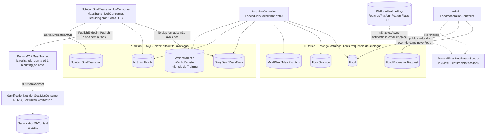

# Nutrição — Design

**Spec**: `ShapeUpApi/.specs/features/nutrition/spec.md`
**Status**: Draft

---

## Approach Chosen (confirmado com o usuário)

Ponto central: `NutritionGoalMet` não é reação a UMA escrita específica (diferente de `WorkoutFinished`, publicado dentro da transação que finaliza uma sessão) — é avaliado no FECHAMENTO DO DIA (meia-noite UTC), um corte por lote. Isso muda a pergunta de "qual outbox usar" para "precisamos de outbox aqui?".

**Decisão (revisada — usuário questionou a v1 deste documento, que propunha um `BackgroundService`/`PeriodicTimer` nativo à parte da mensageria já construída)**: reaproveita a mensageria existente via o **recurring Job Consumer do próprio MassTransit** (`IJobConsumer<T>` + `AddOrUpdateRecurringJob`, expressão cron). Confirmado via pesquisa (MassTransit oficial + doc espelho, ver Tech Decisions): recurring jobs são nativos do MassTransit, funcionam só com o transport já em uso (RabbitMQ) — **Quartz.NET/Hangfire só são necessários se USADOS como scheduler**, não é o caso aqui — e a saga do job aceita qualquer repositório, incluindo EF Core (que já teremos no lado SQL desta feature). Isso é literalmente "criar uma coisa nova lá" (um consumer + 1 registro de recurring job na mesma `MessagingExtensions.cs` já existente), não um segundo sistema de agendamento paralelo. Publica `NutritionGoalMet` a partir de dentro do job consumer, ainda SEM outbox (mesmo raciocínio da v1 — não há uma única escrita de domínio pra ser atômica com; idempotência continua vindo da coluna `EvaluatedAtUtc`/`NutritionGoalEvaluation`, não do outbox). Isso evita mexer no outbox do `event-bus`, que hoje só está configurado pro Mongo do Training (2º publisher Mongo exigiria roteamento por fábrica não resolvido — `event-bus` design.md, Risks) e cujo caminho EF Core/SQL existe só no papel, nunca exercitado.

**Bônus não previsto na v1**: recurring jobs do MassTransit já resolvem, de graça, o risco que a v1 deste documento listava como "aceito" (2 instâncias da API rodando o job em paralelo) — é exatamente o caso de uso pra qual essa feature do MassTransit existe (distribuição/dedup de job agendado entre instâncias de um cluster).

**Incerteza sinalizada (Knowledge Verification Chain Step 5)**: confirmei via busca (não via código do repo, que não usa Job Consumers hoje) que o mecanismo existe e não exige Quartz/Hangfire — mas NÃO tenho confirmação de primeira mão da sintaxe exata de registro (`AddJobSagaStateMachines`/`SetJobConsumerOptions`/nomes exatos de método podem variar por versão do pacote `MassTransit` já usado no projeto). Por ser o PRIMEIRO uso de Job Consumers no repo, a primeira task de Tasks.md deve ser um spike timeboxed (mesmo padrão do T1 de `event-bus`) que prova o registro + 1 execução recorrente real antes de qualquer outra task depender disso — se a API não bater com o esperado, escalar pro usuário antes de continuar, não substituir silenciosamente pelo `BackgroundService` da v1.

**Persistência dividida por frequência de alteração** (critério confirmado com o usuário: dado que muda com pouca frequência mas é muito lido → Mongo; dado alterado com frequência → SQL):

| Dado | Frequência de alteração | Onde |
|---|---|---|
| `Food` (catálogo público) | Criado uma vez, editado raramente (só via fluxo de triagem) — lido em TODA busca/registro de diário | **Mongo** |
| `FoodOverride` (versão pessoal) | Criado uma vez por edição, praticamente imutável até a triagem decidir | **Mongo** |
| `FoodModerationRequest` (fila de triagem) | Uma única transição de estado (pendente→aprovada/recusada) | **Mongo** |
| `MealPlan`/`MealPlanItem` (cardápio fixo) | Criado uma vez, editado ocasionalmente pelo dono — mesmo padrão de `WorkoutPlanDocument`/`WorkoutTemplateDocument` (Training) | **Mongo** |
| `DiaryDay`/`DiaryEntry` (diário do dia) | Alterado repetidamente ao longo do MESMO dia (adiciona/remove/substitui item) | **SQL** |
| `NutritionProfile` (antropometria + meta ativa) | Meta muda quando o usuário redefine — não é write único, mas é lida em conjunto com o diário (mesma transação de avaliação) | **SQL** |
| `WeightTarget`/`WeightRegister` (migrado de Training) | Registro novo por dia (log), meta atualizada ocasionalmente | **SQL** (mesmo cluster de `NutritionProfile`, mesma frequência de escrita do diário) |
| `NutritionGoalEvaluation` (audit/idempotência, espelha `WorkoutEvaluation` de Gamification) | Um registro por dia/usuário, nunca reescrito | **SQL** (precisa estar no mesmo banco/transação que `DiaryDay` pra marcar avaliado atomicamente) |
| `PlatformFeatureFlag` | Raramente alterado, mas lido em todo envio de e-mail | **SQL** — exceção deliberada à heurística: tabela minúscula, singleton-like, ganha mais em consistência simples (mesmo padrão de tabela de config já usado por `Authorization`) do que perderia num Mongo dedicado só pra isso |

Nenhum dos dois lados (SQL ou Mongo) precisa de outbox: o lado Mongo (`Food`/`MealPlan`) nunca publica evento nenhum; o lado SQL só publica via o job diário, que não precisa de atomicidade com uma escrita específica.



---

## Code Reuse Analysis

### Existing Components to Leverage

| Component | Location | How to Use |
|---|---|---|
| `IPublishEndpoint`/`IConsumer<T>` (MassTransit, já registrado) | `Configurations/MessagingExtensions.cs` | Reusado direto — `NutritionGoalEvaluationJob` publica, `GamificationNutritionGoalMetConsumer` consome; nenhuma configuração nova de outbox |
| Padrão de consumer real (classifica/credita/persiste evaluation) | `Features/Gamification/WorkoutFinished/GamificationWorkoutFinishedConsumer.cs` | Molde direto pro novo `GamificationNutritionGoalMetConsumer` — mesma forma (buscar estado atual, aplicar crédito, persistir evidência, idempotência por chave) |
| `WorkoutPlanDocument`/`WorkoutTemplateDocument` (Mongo, Training) | `Features/Training/Shared/Documents/` | Molde de schema pra `MealPlan`/`MealPlanItem` (mesma forma "documento com itens aninhados") |
| `CapabilityPolicyProvider`/`[Authorize(Policy="capability:platform.*")]` (AD-006) | `Features/Authorization/Resolver/` | Reusado sem nenhuma alteração — novas capabilities (`platform.nutrition_foods.moderate`, `platform.feature_flags.manage`) funcionam automaticamente, política dinâmica já resolve qualquer string nova |
| `IEmailNotificationSender`/`ResendEmailNotificationSender` | `Features/Notifications/Infrastructure/Resend/` | Ganha 1 checagem de flag no início do método de envio — resto do fluxo intocado |
| `GymManagementDbContext`/`GamificationDbContext` (Fluent EF Core, `Features/{Domain}/Infrastructure/Data/`) | vários | Molde pra `NutritionDbContext` e pro tiny `PlatformFeatureFlagsDbContext` |
| Mongo DB registration por domínio (`Mongo__Training__ConnectionString`) | `Features/Training/Infrastructure/Mongo/` | Molde pra `Mongo__Nutrition__ConnectionString` — banco próprio, mesmo servidor Mongo do `docker-compose.yml`, sem criar infra nova |
| `useTrainingApi.js`/`useGamificationApi.js` (hook shape) | `ShapeUp-Web/src/hooks/api/` | Molde pra `useNutritionApi.js` (novo) |
| `Card`, tokens de `design-system.css`, `lucide-react` | `ShapeUp-Web/src/components/shared/` | Reusados nas telas novas — sem lib de UI nova |
| Barcode Detection API (nativa do browser) | N/A (nunca usada no repo ainda) | Primeira vez usada — feature-detect (`'BarcodeDetector' in window`), fallback pra input manual |
| Fórmula de streak/milestone (mesmo espírito, streak separado) | `Features/Gamification/Shared/` (lógica de incremento/reset por dia) | Reaproveita o MESMO raciocínio (incrementa se dia seguinte, mantém se mesmo dia, reseta se gap) — implementado como campo próprio em `GamificationProfile`, não uma nova classe genérica (YAGNI — só 1 consumidor a mais) |
| `mutationQueue.js`/`enqueueMutation`/`useMutationQueue` (fila offline, Fase 1) + `utils/objectId.js` (id client-side) | `ShapeUp-Web/src/services/mutationQueue.js`, `ShapeUp-Web/src/utils/objectId.js` | Registro de refeição no diário passa por aqui — mesmo mecanismo já usado por `startWorkout`/`createWorkoutPlan` (id gerado no cliente, aceito como veio pelo backend); nenhuma fila nova, nenhum mecanismo de sync novo |

### Integration Points

| System | Integration Method |
|---|---|
| `event-bus` (MassTransit, já implementado) | Publish direto via `IPublishEndpoint`, SEM outbox — decisão explícita pra não tocar no outbox existente nem abrir o caminho EF Core não testado |
| `Gamification` (já implementado, T1–T19 fechado) | Novo consumer + nova coluna/streak — feature já fechada ganha uma extensão pontual, não uma reabertura de escopo |
| `Training` (migração, não leitura cross-domain) | `WeightTracking` inteiro migra de `Features/Training` pra `Features/Nutrition` — rotas, handlers, documentos Mongo, tudo |
| `Notifications` (já implementado) | `ResendEmailNotificationSender` ganha 1 dependência nova (`IFeatureFlagReader`) |
| `Authorization` (já implementado, AD-006) | Zero mudança — só uso do padrão `platform.*` já pronto |

---

## Components

### `Features/Nutrition/Shared/Documents/Food.cs` + `FoodOverride.cs` + `FoodModerationRequest.cs` (Mongo)

- **Purpose**: Catálogo colaborativo de alimentos + override pessoal + fila de triagem
- **Location**: `Features/Nutrition/Shared/Documents/`
- **Interfaces**: `IFoodRepository` (`SearchAsync` — exclui `IsDeleted`, `GetByBarcodeAsync`, `GetByIdAsync`, `CreateAsync`, `ApplyApprovedOverrideAsync`, `SoftDeleteAsync` — idempotente, no-op se já excluído), `IFoodOverrideRepository` (`GetActiveForUserAsync`, `CreateAsync`, `SetActiveAsync`), `IFoodModerationRepository` (`GetPendingAsync`, `DecideAsync` — idempotente, rejeita 2ª decisão sobre a mesma fila); `FoodsController.Delete` atrás de `[Authorize(Policy="capability:platform.nutrition_foods.moderate")]` (mesma capability da triagem — administrador ShapeUp é o público de ambas as ações)
- **Dependencies**: MongoDB (`Mongo__Nutrition__ConnectionString`, banco próprio)
- **Reuses**: forma de repositório Mongo já usada em `Features/Training/Infrastructure/Mongo/`

### `Features/Nutrition/Shared/Documents/MealPlan.cs` + `MealPlanItem` (Mongo)

- **Purpose**: Cardápio fixo do usuário (refeições + alimentos + quantidades), com `PrescribedByRelationshipId` nullable reservado pra Fase 5
- **Location**: `Features/Nutrition/Shared/Documents/MealPlan.cs`
- **Interfaces**: `IMealPlanRepository` (`GetByUserAsync`, `CreateAsync`, `UpdateAsync`, `GetActiveAsync`)
- **Dependencies**: MongoDB (mesmo banco de `Food`)
- **Reuses**: forma de `WorkoutPlanDocument` (Training) — documento com lista de itens aninhados

### `Features/Nutrition/Shared/Entities/{DiaryDay,DiaryEntry}.cs` (SQL, EF Core)

- **Purpose**: Diário alimentar do dia — alto volume de escrita/remoção dentro do mesmo dia
- **Location**: `Features/Nutrition/Shared/Entities/`
- **Interfaces**: acessado via `NutritionDbContext` diretamente pelos handlers (mesmo padrão de `GymManagementDbContext`)
- **Dependencies**: `NutritionDbContext` (SQL Server)
- **Reuses**: convenção Fluent config EF Core já usada em todo domínio SQL do repo

### `Features/Nutrition/Shared/Entities/NutritionProfile.cs` (SQL, EF Core) — inclui `WeightTarget`/`WeightRegister` migrados

- **Purpose**: Antropometria (altura/idade/sexo/atividade), meta ativa de macros, e o que hoje é `WeightTargetDocument`/`WeightRegisterDocument` migrado de `Training`
- **Location**: `Features/Nutrition/Shared/Entities/NutritionProfile.cs`, `WeightTarget.cs`, `WeightRegister.cs`
- **Interfaces**: `INutritionProfileRepository` (`GetByUserAsync`, `UpsertAsync`), `IWeightTrackingRepository` (mesma assinatura de método que já existe hoje em Training — só muda o namespace/localização, não o contrato, pra minimizar o diff no frontend)
- **Dependencies**: `NutritionDbContext`
- **Reuses**: campos/lógica de `WeightTargetDocument`/`WeightRegisterDocument` (Training) — migrados, não recriados do zero

### `TdeeCalculator`

- **Purpose**: Calcular meta diária de macros via Mifflin-St Jeor + fator de atividade
- **Location**: `Features/Nutrition/Shared/TdeeCalculator.cs`
- **Interfaces**: `MacroGoal Calculate(NutritionProfile profile, decimal currentWeightKg)` → `MacroGoal(int Kcal, int ProteinG, int CarbG, int FatG)`
- **Dependencies**: nenhuma (função pura, unit-testável sem I/O — mesmo espírito de `IAntiCheatClassifier` em Gamification)
- **Reuses**: nada — cálculo novo, mas desenhado pure-function pelo mesmo motivo que `AntiCheatClassifier` foi (testável isolado)

### `NutritionGoalEvaluationJobConsumer` (MassTransit Job Consumer, recurring)

- **Purpose**: 1x/dia (00:05 UTC), varre `DiaryDay` do dia anterior sem `EvaluatedAtUtc`, verifica se os 3 macros (proteína/carbo/gordura) estão dentro de ±10% da meta ativa daquele dia, publica `NutritionGoalMet` SÓ quando bateu (nunca publica evento de "não bateu"), sempre marca `EvaluatedAtUtc` (bateu ou não, evita reavaliar). Escopo da varredura é `WHERE Date = ontem AND EvaluatedAtUtc IS NULL` — só existe uma linha de `DiaryDay` pra um usuário/dia se ele registrou algo naquele dia; quem não usou o app naquele dia não gera linha nenhuma, então não é varrido, não é "checado", e seu streak simplesmente não é renovado (ver derivação de leitura no Data Model de `GamificationProfile`) — não é um scan cego sobre toda a base de usuários, é proporcional a quem teve atividade
- **Location**: `Features/Nutrition/GoalEvaluation/NutritionGoalEvaluationJobConsumer.cs` (job consumer) + registro do recurring job em `Configurations/MessagingExtensions.cs` (arquivo já existente, ganha 1 bloco novo — não uma reestruturação)
- **Interfaces**: `class NutritionGoalEvaluationJobConsumer : IJobConsumer<EvaluateNutritionGoals>` — `Task Run(JobContext<EvaluateNutritionGoals> context)`; registrado via `AddOrUpdateRecurringJob` com cron `"0 5 0 * * *"` na inicialização (`Program.cs`/`MessagingExtensions`)
- **Dependencies**: `NutritionDbContext`, `IPublishEndpoint`, saga repository do Job Consumer (EF Core — reaproveita `NutritionDbContext`, sem banco/tecnologia nova só pra isso)
- **Reuses**: mensageria já registrada (`MessagingExtensions.cs`, MassTransit/RabbitMQ do `event-bus`) — nenhum sistema de agendamento novo e paralelo; primeiro uso de Job Consumers no repo, ver Risks & Concerns pro spike de validação

### `NutritionGoalMet` (evento)

- **Purpose**: Contrato mínimo pro consumer de Gamification agir
- **Location**: `Features/Nutrition/Shared/Events/NutritionGoalMet.cs`
- **Interfaces**: `record NutritionGoalMet(int UserId, DateOnly Date)`
- **Dependencies**: nenhuma
- **Reuses**: mesmo espírito minimalista de `WorkoutFinished` (carrega só identificadores, consumer busca detalhe se precisar — aqui não precisa, o evento já é auto-suficiente)

### `GamificationNutritionGoalMetConsumer` (novo, dentro de `Features/Gamification`)

- **Purpose**: Creditar XP/ShapeCoins e evoluir um streak nutricional PRÓPRIO (campo novo, não reaproveita `CurrentStreak` de treino)
- **Location**: `Features/Gamification/NutritionGoalMet/GamificationNutritionGoalMetConsumer.cs`
- **Interfaces**: `class GamificationNutritionGoalMetConsumer : IConsumer<NutritionGoalMet>`
- **Dependencies**: `GamificationDbContext` (já existe)
- **Reuses**: `GamificationProfile` ganha `NutritionCurrentStreak`/`LastNutritionGoalMetDateUtc` (mesmas colunas simples que streak de treino, duplicadas pro conceito novo — AD-011 já estabeleceu "colunas simples, não tabela de eventos" como padrão aceito); `NutritionGoalEvaluation` (SQL, `Features/Gamification`) espelha `WorkoutEvaluation` — idempotência belt-and-suspenders por `(UserId, Date)`

### `Features/PlatformFeatureFlags` (feature nova, isolada — não é Nutrição)

- **Purpose**: Kill-switch global on/off por chave, lido por qualquer feature
- **Location**: `Features/PlatformFeatureFlags/` (irmã de `Features/Nutrition`, não dentro dela — é capability de plataforma, só entregue nesta spec por pedido explícito do usuário)
- **Interfaces**: `IFeatureFlagReader.IsEnabledAsync(string key, CancellationToken ct)` (fail-open: linha ausente → `true`); `PlatformFeatureFlagsController` (`GET /api/platform/feature-flags`, `PUT /api/platform/feature-flags/{key}`) atrás de `[Authorize(Policy="capability:platform.feature_flags.manage")]`
- **Dependencies**: `PlatformFeatureFlagsDbContext` (SQL, tabela única `PlatformFeatureFlag(Key PK, Enabled, UpdatedAtUtc, UpdatedByUserId)`, seed `notifications.email-enabled = true`)
- **Reuses**: convenção `platform.*`/AD-006 pra autorização

### `ResendEmailNotificationSender` (editado)

- **Purpose**: Ganha a checagem de flag antes de chamar a API do Resend
- **Location**: `Features/Notifications/Infrastructure/Resend/ResendEmailNotificationSender.cs` (arquivo existente, editado)
- **Interfaces**: construtor ganha `IFeatureFlagReader`; método de envio faz `if (!await _flags.IsEnabledAsync("notifications.email-enabled", ct)) { log + return success-no-op; }` antes do resto
- **Dependencies**: `IFeatureFlagReader` (novo)
- **Reuses**: estrutura existente, só adiciona 1 guard clause no topo

### Frontend — `useNutritionApi.js`, telas de diário/cadastro/cardápio/progresso

- **Purpose**: Consumir todos os endpoints acima
- **Location**: `ShapeUp-Web/src/hooks/api/useNutritionApi.js` (novo, absorve também as 3 funções de peso que saem de `useTrainingApi.js`); `ShapeUp-Web/src/pages/Dashboard/Nutrition*.jsx` (novo)
- **Interfaces**: mesmo shape de `useTrainingApi.js`/`useGamificationApi.js` (`useCallback` por método, `apiClient` por baixo); a função de registrar refeição especificamente NÃO chama `apiClient` direto — chama `enqueueMutation` (mesmo padrão de `startWorkout`), com `id` (`utils/objectId.js`) e `Date` gerados no cliente antes de enfileirar
- **Dependencies**: `apiClient` (existente), `mutationQueue.js`/`enqueueMutation` (existente, Fase 1)
- **Reuses**: `Card`, tokens de design-system, `GamificationProgressCard` como referência visual pro card de progresso de macro (barra/anel de progresso é novo — não existe componente de anel no repo hoje, avaliar em Tasks se vale um componente `MacroRing` reutilizável ou inline); fila offline já existente (nenhum mecanismo de sync novo) — mobile (Fase 6, futuro) implementa o mesmo contrato de id/data client-side quando existir, sem exigir mudança no endpoint

---

## Data Models

```csharp
// Features/Nutrition/Shared/Documents/Food.cs (Mongo)
public class FoodDocument
{
    public string Id { get; set; } = null!;             // ObjectId
    public string Name { get; set; } = null!;
    public string? Barcode { get; set; }                 // unique index quando não-nulo
    public MacroValueObject MacrosPer100 { get; set; } = null!;   // Kcal, ProteinG, CarbG, FatG — obrigatórios
    public MicroValueObject? MicrosPer100 { get; set; }  // vitaminas/minerais — opcional
    public HouseholdMeasure? Measure { get; set; }        // "1 fatia = 30g" — opcional, só atalho de UI
    public int CreatedByUserId { get; set; }
    public DateTime CreatedAtUtc { get; set; }
    public bool IsDeleted { get; set; }                   // soft-delete admin (NUT-13) — excluído nunca aparece em busca/novo registro, mas DiaryEntry passado (macros já computados) e MealPlanItem existente continuam íntegros
    public int? DeletedByUserId { get; set; }
    public DateTime? DeletedAtUtc { get; set; }
}

// Features/Nutrition/Shared/Documents/FoodOverride.cs (Mongo)
public class FoodOverrideDocument
{
    public string Id { get; set; } = null!;
    public string FoodId { get; set; } = null!;           // qual Food público originou
    public int UserId { get; set; }
    public MacroValueObject MacrosPer100 { get; set; } = null!;
    public MicroValueObject? MicrosPer100 { get; set; }
    public bool IsActive { get; set; }                    // usuário está vendo esta versão agora?
    public DateTime CreatedAtUtc { get; set; }
}

// Features/Nutrition/Shared/Documents/FoodModerationRequest.cs (Mongo)
public class FoodModerationRequestDocument
{
    public string Id { get; set; } = null!;
    public string FoodId { get; set; } = null!;
    public string FoodOverrideId { get; set; } = null!;
    public int RequestedByUserId { get; set; }
    public string Status { get; set; } = "Pending";        // Pending|Approved|Rejected — transição única
    public int? DecidedByUserId { get; set; }
    public DateTime? DecidedAtUtc { get; set; }
    public DateTime CreatedAtUtc { get; set; }
}

// Features/Nutrition/Shared/Entities/DiaryDay.cs (SQL)
public class DiaryDay
{
    public int Id { get; set; }
    public int UserId { get; set; }
    public DateOnly Date { get; set; }                     // unique (UserId, Date)
    public DateTime? EvaluatedAtUtc { get; set; }           // null até o job diário processar
    public List<DiaryEntry> Entries { get; set; } = [];
}

// Features/Nutrition/Shared/Entities/DiaryEntry.cs (SQL)
public class DiaryEntry
{
    public string Id { get; set; } = null!;                  // gerado no CLIENTE (Mongo ObjectId-shaped, utils/objectId.js) — mesmo padrão de StartWorkoutExecutionCommand/CreateWorkoutPlanCommand; PK, retry da fila offline é idempotente (mesmo id = mesmo efeito, upsert)
    public int DiaryDayId { get; set; }                      // resolvido/criado a partir da Date enviada pelo cliente, NUNCA de "agora do servidor" — sincronização tardia (offline) ainda cai no dia certo
    public string MealSlot { get; set; } = null!;            // "breakfast"|"lunch"|"dinner"|"snack"
    public string FoodId { get; set; } = null!;              // referência ao Mongo Food/FoodOverride — sem FK (cross-DB, mesmo espírito de WorkoutEvaluation.SessionId)
    public bool UsesOverride { get; set; }
    public decimal QuantityGramsOrMl { get; set; }
    public MacroValueObject ComputedMacros { get; set; } = null!;   // já calculado (quantidade × por-100) no momento do registro — evita recalcular toda leitura
}

// Features/Nutrition/Shared/Entities/NutritionProfile.cs (SQL)
public class NutritionProfile
{
    public int UserId { get; set; }                         // PK
    public int? HeightCm { get; set; }
    public int? Age { get; set; }
    public string? BiologicalSex { get; set; }              // "Male"|"Female"
    public string? ActivityLevel { get; set; }              // "Sedentary"|"Light"|"Moderate"|"Active"|"VeryActive"
    public bool OnboardingSkipped { get; set; }
    public MacroValueObject? ActiveGoal { get; set; }        // null até primeira meta (TDEE ou manual)
    public DateTime UpdatedAtUtc { get; set; }
}

// Features/Nutrition/Shared/Entities/WeightTarget.cs / WeightRegister.cs (SQL) — migrados de Training, mesmos campos
public class WeightTarget { public int Id {get;set;} public int UserId {get;set;} public decimal TargetWeight {get;set;} public DateTime UpdatedAtUtc {get;set;} }
public class WeightRegister { public int Id {get;set;} public int UserId {get;set;} public decimal Weight {get;set;} public DateOnly Date {get;set;} }

// Features/Nutrition/GoalEvaluation/NutritionGoalEvaluation.cs (SQL) — audit/idempotência do job
public class NutritionGoalEvaluation
{
    public int Id { get; set; }
    public int UserId { get; set; }
    public DateOnly Date { get; set; }                      // unique (UserId, Date)
    public bool GoalMet { get; set; }
    public DateTime EvaluatedAtUtc { get; set; }
}

// Features/Gamification/Shared/Entities/GamificationProfile.cs (EDITADO — colunas novas)
// + public int NutritionCurrentStreak { get; set; }        // incrementado SÓ pelo consumer (dia bateu meta) — nunca decrementado/resetado por nenhum job/evento
// + public DateOnly? LastNutritionGoalMetDate { get; set; } // única fonte pra derivar o streak "real" na leitura
// Leitura (GetGamificationProfileHandler, já existente, ganha esta regra): streak EXIBIDO =
//   NutritionCurrentStreak SE LastNutritionGoalMetDate ∈ {hoje, ontem}, SENÃO 0 (dia perdido nunca
//   precisa ser "detectado" ativamente — a coluna armazenada fica desatualizada até a próxima meta
//   batida renová-la, e a leitura já esconde isso sem nenhum job/evento extra)

// Features/Gamification/NutritionGoalMet/NutritionGoalEvaluation.cs (SQL, Gamification) — espelha WorkoutEvaluation
public class GamificationNutritionEvaluation
{
    public int UserId { get; set; }
    public DateOnly Date { get; set; }                      // PK composta (UserId, Date) — idempotência de crédito
    public DateTime CreditedAtUtc { get; set; }
}

// Features/PlatformFeatureFlags/Shared/Entities/PlatformFeatureFlag.cs (SQL)
public class PlatformFeatureFlag
{
    public string Key { get; set; } = null!;                // PK, ex.: "notifications.email-enabled"
    public bool Enabled { get; set; }
    public DateTime UpdatedAtUtc { get; set; }
    public int? UpdatedByUserId { get; set; }
}
```

**Relationships**: `DiaryEntry.FoodId` referencia `FoodDocument`/`FoodOverrideDocument` (Mongo) sem FK — mesma referência convencional cross-tecnologia já aceita em `WorkoutEvaluation.SessionId` (Gamification→Training). `NutritionGoalEvaluation` (Nutrition, SQL) e `GamificationNutritionEvaluation` (Gamification, SQL) são tabelas DIFERENTES em bancos/contextos diferentes — a primeira é o registro de "o dia foi avaliado" (produtor), a segunda é "o crédito foi dado" (consumidor), cada uma com sua própria idempotência, sem acoplamento direto.

---

## Error Handling Strategy

| Error Scenario | Handling | User Impact |
|---|---|---|
| `NutritionGoalEvaluationJob` falha no meio da varredura (processo reiniciado) | Próxima execução do job retoma pelos `DiaryDay` ainda com `EvaluatedAtUtc IS NULL` — nada é perdido, nada é reavaliado 2x | Nenhum — crédito de XP/streak nunca duplica nem se perde |
| `GamificationNutritionGoalMetConsumer` recebe `NutritionGoalMet` duplicado (redelivery do bus) | Checa `GamificationNutritionEvaluation` por `(UserId, Date)` antes de creditar — no-op se já existe | Nenhum |
| Usuário tenta editar ou registrar um alimento marcado `IsDeleted` | Tratado como "não encontrado" pra fluxo normal (não aparece em busca); se acessado por id direto (ex.: deep-link antigo), operação é bloqueada com mensagem "alimento não está mais disponível" | Usuário é orientado a buscar/cadastrar outro |
| Cardápio fixo ativo referencia `Food` marcado `IsDeleted` no momento de ativar/aplicar o cardápio | Sistema NÃO aplica o item silenciosamente — sinaliza como indisponível e abre a tela de substituição já existente (NUT-10) | Usuário substitui o item indisponível antes de seguir |
| `TdeeCalculator` recebe perfil incompleto (usuário pulou onboarding e nunca definiu meta manual) | Retorna null/indisponível — diário funciona normalmente sem meta (spec NUT-06 AC4), job de avaliação pula usuários sem meta ativa (não publica, não credita, não penaliza) | Usuário só não vê progresso de meta até definir uma |
| `IFeatureFlagReader` não encontra a chave consultada | Fail-open (retorna `true`) — nunca derruba um canal que ninguém desligou de propósito | Nenhum |
| Entrada de diário sincroniza (fila offline) DEPOIS que `NutritionGoalEvaluationJobConsumer` já avaliou aquele dia (`EvaluatedAtUtc` já preenchido) | Entrada é persistida normalmente na `Date` correta (nunca perdida), mas NÃO reabre a avaliação nem reemite `NutritionGoalMet` retroativamente (mesmo comportamento já coberto no Edge Cases da spec para edição retroativa manual) | Usuário vê o registro retroativo refletido no diário daquele dia; XP/streak daquele dia específico não mudam retroativamente |
| Dois usuários aprovam/recusam a mesma `FoodModerationRequest` "ao mesmo tempo" (dois admins) | `DecideAsync` é condicional (`WHERE Status = 'Pending'`) — segunda decisão não encontra a linha em `Pending`, retorna erro "já decidida" | Segundo admin vê mensagem de conflito, não um erro genérico |

---

## Risks & Concerns

| Concern | Location | Impact | Mitigation |
|---|---|---|---|
| Migração de `WeightTracking` (Training→Nutrition) muda rota (`/api/training/weight/*` → `/api/nutrition/weight/*`) e hook (`useTrainingApi`→`useNutritionApi`) | `WeightTrackingController.cs`, `useTrainingApi.js:205-245`, `ObjectivesClient.jsx` (único consumidor confirmado) | Se algum outro consumidor existir e não for pego na migração, quebra silenciosamente | Tasks inclui grep explícito por toda referência a `training/weight` (rota) e às 3 funções de peso (frontend) antes de remover o código antigo — não só mover, confirmar zero sobra |
| Primeiro uso de MassTransit Job Consumers no repo (`event-bus` só exercitou publish/consume simples, nunca job saga/recurring) — sintaxe exata de registro (nomes de método de `AddJobSagaStateMachines`/`SetJobConsumerOptions`/equivalente) não confirmada de primeira mão, só via busca | `NutritionGoalEvaluationJobConsumer`, `Configurations/MessagingExtensions.cs` | Se a API não bater com o que a busca indicou (mudou entre versões do pacote, por exemplo), a primeira tentativa de registro pode não compilar/rodar como esperado | Spike timeboxed como primeira task (mesmo padrão do T1 de `event-bus`): registrar 1 recurring job trivial (log + no-op) e confirmar execução real antes de qualquer task que dependa disso. Se falhar, escalar pro usuário com o erro concreto antes de recorrer a um `BackgroundService` nativo — não substituir silenciosamente |
| `Food`/`FoodOverride`/`MealPlan` num banco Mongo NOVO e próprio (`Mongo__Nutrition__ConnectionString`), separado do banco do Training | `docker-compose.yml`, `Configurations/` | Mais uma connection string pra gerenciar; nenhum risco técnico novo (mesmo servidor Mongo, replica set já configurado pelo AD-010) | Nenhuma — reaproveita o replica-set já existente, só adiciona um banco lógico novo |
| Cálculo de similaridade de macro (sugestão de substituição, distância euclidiana normalizada) roda sobre TODO o catálogo de `Food` a cada substituição pedida — sem índice/pre-cálculo | `Features/Nutrition/SuggestSubstitute/` | Pode ficar lento conforme o catálogo cresce (milhares de alimentos cadastrados por usuários) | Aceito no MVP (YAGNI — sem tráfego real ainda pra medir); otimização futura seria um índice vetorial ou pré-filtro por categoria — não construído sem problema de performance real observado |
| `NutritionDbContext` é o primeiro caso no repo de uma feature com AMBOS SQL e Mongo dentro do MESMO domínio (Training tem os dois, mas em sub-áreas historicamente separadas: catálogo vs. execução) | Estrutura de pastas `Features/Nutrition/` | Risco de organização confusa (qual parte é SQL, qual é Mongo) se não for explícito | Mitigado pela tabela de classificação no topo deste documento + nomenclatura de pasta (`Shared/Documents/` = Mongo, `Shared/Entities/` = SQL — convenção já usada por Training, só formalizada aqui) |

---

## Tech Decisions

| Decision | Choice | Rationale |
|---|---|---|
| Publicação de `NutritionGoalMet` sem outbox | `IPublishEndpoint.Publish` direto, dentro de um `BackgroundService` diário | Evita o único ponto não resolvido do `event-bus` (2º publisher Mongo ou outbox EF Core nunca testado) — a natureza do requisito (avaliação de fechamento de dia, não reação a 1 escrita) torna outbox desnecessário, não só evitável |
| Persistência dividida por frequência de alteração, não por "catálogo vs. execução" | Ver tabela no topo | Critério explícito do usuário — mais direto que replicar cegamente a divisão de Training, que nasceu de outra razão histórica |
| Job agendado via `BackgroundService`/`PeriodicTimer` nativo, sem Quartz/Hangfire | `.NET` puro | Uma execução diária não justifica dependência nova (ladder: nativo já resolve) |
| Streak nutricional como colunas novas em `GamificationProfile`, não tabela própria | Mesmo padrão do streak de treino | Consistente com AD-011 (sinal mínimo, colunas simples, não motor de eventos) |
| `PlatformFeatureFlags` como feature própria e separada de `Nutrition` | `Features/PlatformFeatureFlags/` | Mantém limite de domínio honesto mesmo sendo entregue nesta spec — facilita a feature ser encontrada/estendida depois sem procurar dentro de "Nutrition" |
| `WeightTracking` migra por completo (não fica em Training com leitura cross-domain) | Módulo inteiro (documentos, handlers, controller, rota, hook frontend) muda de dono | Decisão explícita do usuário — antropometria pertence a Nutrição |

> **Project-level**: nenhuma decisão aqui contradiz um `AD-NNN` ativo existente. Duas decisões merecem virar `AD` novo em `ShapeUpApi/.specs/STATE.md` quando este design for aprovado: (1) "eventos que reagem a um FECHAMENTO/corte temporal, não a uma escrita específica, publicam via `IPublishEndpoint` direto sem outbox — outbox é só para eventos atômicos com uma escrita de domínio pontual" (convenção pra toda feature futura com esse mesmo formato); (2) "persistência dentro de um domínio pode dividir por frequência de alteração (baixa→Mongo, alta→SQL), não só por categoria de dado" (convenção alternativa à que Training usa, ambas válidas conforme o caso).

---

## Tips (não editar — referência do processo)

- Confirmar este design antes de ir pra Tasks.
