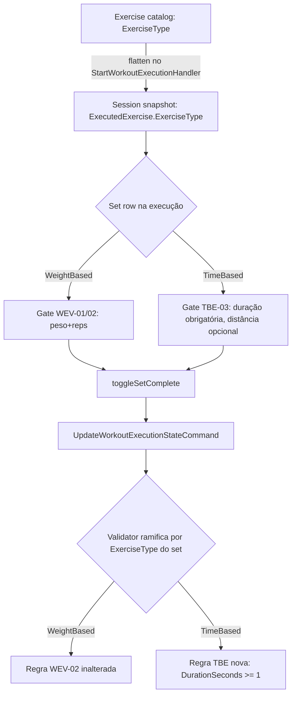

# Exercícios Baseados em Tempo — Design

**Spec**: `.specs/features/time-based-exercises/spec.md`
**Status**: Draft

---

## Architecture Overview

Nenhum componente novo de infraestrutura. A feature estende três pontos já existentes na vertical-slice `Training`:

1. **Catálogo** (`Features/Training/Shared/Entities/Exercise.cs`, SQL/EF) ganha `ExerciseType`.
2. **Set** (planejamento `PlannedSetDocumentValueObject`, execução `WorkoutSetValueObject`/`ExecutedSetDocumentValueObject`, todos Mongo) ganha `DurationSeconds`/`DistanceMeters` nullable, e `Load`/`Repetitions` passam a nullable.
3. **Validação** (`workout-editor` ao salvar plano, `UpdateWorkoutExecutionStateCommandValidator` na execução, `TrainingPlansClient.jsx` client-side) ramifica pelo `ExerciseType` do exercício-pai do set, reaproveitando o mesmo mecanismo de snapshot já usado por `RequireRpe` (`WEV-05`).



---

## Code Reuse Analysis

### Existing Components to Leverage

| Component | Location | How to Use |
|---|---|---|
| `RequireRpe` flatten pattern | `StartWorkoutExecutionHandler` (spec `WEV-05`) | Mesmo mecanismo exato para propagar `ExerciseType` do catálogo até o snapshot da sessão — nenhum mecanismo novo de propagação |
| `RestSeconds: int?` no set VO | `PlannedSetDocumentValueObject.cs:18`, `WorkoutSetValueObject.cs:6` | Precedente direto de campo nullable-por-natureza no mesmo VO — `DurationSeconds`/`DistanceMeters` seguem o mesmo padrão de tipo e nullability |
| `IntensityDocumentValueObject`/`IntensityDto` (`Intensity{Type, Value}`) | `Features/Training/Shared/...` | Reusado sem alteração — RPE continua igual para os dois tipos de exercício, nenhuma mudança de shape |
| Client-side gate + indicação visual (`toggleSetComplete`, shake/highlight) | `TrainingPlansClient.jsx:439` (padrão estabelecido por `WEV-01`) | Mesma função ganha um `if/else` por `ExerciseType`, reaproveitando a mesma indicação visual de campo faltante |
| Validator FluentValidation já existente | `UpdateWorkoutExecutionStateCommandValidator.cs` (ver `WEV-02`/`WEV-07`) | Ganha uma regra condicional adicional (`When(set => exerciseType == TimeBased, ...)`), não um validator paralelo |
| `platform.*`/capability de edição de plano já usada no `workout-editor` | `Features/Authorization` (AD-001/AD-006) | Nenhuma capability nova — cadastro de `ExerciseType` usa a mesma autorização que já protege edição de catálogo/plano |

### Integration Points

| System | Integration Method |
|---|---|
| `workout-editor` (autoria de plano) | `ExerciseType` lido do catálogo ao adicionar exercício a um bloco; UI de set do editor ramifica pelo tipo já na tela de montagem |
| `workout-execution-validation` (`WEV-01`/`WEV-02`/`WEV-05`/`WEV-07`) | Gate de conclusão e `RequireRpe` continuam intactos para `WeightBased`; esta feature adiciona o gate paralelo `TimeBased` no MESMO ponto de código (mesma função client-side, mesmo validator backend) |
| `Gamification`/`ShapeScore`/anti-cheat/dashboard (`GetTrainingDashboardHandler`, `AntiCheatClassifier`) | Nenhuma mudança de código — `Volume => Load * Repetitions` naturalmente resolve para `0` quando `Load`/`Repetitions` são nulos (set `TimeBased`). Ver `Risks & Concerns` e a seção Cross-Cutting Dependencies da spec |
| `FinishWorkoutExecutionHandler.cs:104-107` / `CompleteWorkoutSessionHandler.cs:51-54` (detecção de PR) | Ganha um segundo tipo de PR, `"best_pace"` (ver componente abaixo), avaliado em paralelo ao `"max_volume"` já existente — não substitui, não altera a lógica de `max_volume` para sets `WeightBased` |

---

## Components

### `ExerciseType` (enum, catálogo)

- **Purpose**: Classifica um exercício do catálogo como medido por peso+reps ou por duração(+distância)
- **Location**: `src/Features/Training/Shared/Enums/ExerciseType.cs` (novo arquivo, mesmo padrão de `LoadUnit.cs`/`SetType.cs`/`Technique.cs`/`BlockType.cs` já existentes na mesma pasta)
- **Interfaces**: `enum ExerciseType { WeightBased = 1, TimeBased = 2 }`
- **Dependencies**: nenhuma
- **Reuses**: convenção de enum simples já usada por todos os outros enums da pasta (`int` numerado, sem flags)

### `Exercise.ExerciseType` (propriedade nova)

- **Purpose**: Persiste o tipo do exercício no catálogo relacional
- **Location**: `src/Features/Training/Shared/Entities/Exercise.cs`
- **Interfaces**: `public ExerciseType ExerciseType { get; set; } = ExerciseType.WeightBased;`
- **Dependencies**: migration EF Core nova (coluna com default `WeightBased` para preservar todo dado existente)
- **Reuses**: mesmo padrão de propriedade simples já usado por `Name`/`Description` na mesma entidade

### Set VOs — campos de duração/distância (planejamento + execução)

- **Purpose**: Permitir que um set descreva duração/distância em vez de (ou além de, estruturalmente) peso/reps
- **Location**: `PlannedSetDocumentValueObject.cs` (planejamento, Mongo), `WorkoutSetValueObject.cs` (execução, record), `ExecutedSetDocumentValueObject.cs` (execução persistida, Mongo)
- **Interfaces**:
  - `PlannedSetDocumentValueObject`: `+ public int? DurationSeconds { get; set; }` / `+ public decimal? DistanceMeters { get; set; }`; `Load` muda de `decimal` para `decimal?`
  - `WorkoutSetValueObject` (record): `+ int? DurationSeconds, decimal? DistanceMeters`; `Load` muda de `decimal` para `decimal?`
  - `ExecutedSetDocumentValueObject`: mesmos dois campos novos; `Volume` (computed) passa a `Load.HasValue && Repetitions.HasValue ? Load.Value * Repetitions.Value : 0m` (hoje assume os dois sempre presentes)
- **Dependencies**: nenhuma migração de dado necessária em Mongo (documentos existentes simplesmente não têm os campos novos, que ficam `null` — comportamento padrão do driver Mongo/BSON para campo ausente)
- **Reuses**: mesmo padrão nullable já usado por `RestSeconds: int?` no mesmo VO

### Gate de conclusão condicional (client-side)

- **Purpose**: Decide, na tela de execução, se o set exige peso+reps (`WEV-01`) ou duração (`TBE-03`), conforme `ExerciseType` do exercício do snapshot da sessão
- **Location**: `ShapeUp-Web/src/pages/Dashboard/TrainingPlansClient.jsx`, função `toggleSetComplete` (linha 439) e a árvore de render do set-row (linhas ~1095-1200)
- **Interfaces**: `toggleSetComplete(exerciseIndex, setIndex, defaultRest)` — mesma assinatura, corpo ganha `if (exercise.exerciseType === 'TimeBased') { validar duração } else { validar peso/reps, como hoje }`
- **Dependencies**: `exercise.exerciseType` precisa estar presente no snapshot da sessão retornado pela API (já resolvido pelo flatten do backend, ver componente de handler abaixo)
- **Reuses**: mesmo padrão de indicação visual (highlight/shake) já usado pelo gate `WEV-01`

### Gate de conclusão condicional (server-side)

- **Purpose**: Reforço server-side (defense in depth) do gate `TBE-03`, espelhando `WEV-02`
- **Location**: `UpdateWorkoutExecutionStateCommandValidator.cs` (mesmo validator de `WEV-02`/`WEV-07`)
- **Interfaces**: regra FluentValidation adicional, ramificada por `ExerciseType` do exercício correspondente na sessão (`RuleForEach(x => x.Sets).ChildRules(...)` com `When`)
- **Dependencies**: validator precisa resolver o `ExerciseType` do exercício de cada set — mesmo mecanismo já usado para resolver `RequireRpe` por exercício em `WEV-07` (lookup no snapshot da sessão carregada)
- **Reuses**: estrutura de regra condicional (`When`) já introduzida pelo fix de `WEV-07` para `Intensity` opcional/obrigatório

### Flatten de `ExerciseType` no start da sessão

- **Purpose**: Propagar `ExerciseType` do catálogo para o snapshot da sessão de execução, mesmo princípio de `RequireRpe`
- **Location**: `StartWorkoutExecutionHandler` (mesmo handler já estendido por `WEV-05`)
- **Interfaces**: nenhuma assinatura nova — o mapeamento exercício→DTO ganha mais um campo copiado
- **Dependencies**: nenhuma
- **Reuses**: 100% do mecanismo de flatten já existente, só adiciona um campo ao mapeamento

### Editor de set — UI condicional por tipo (workout-editor)

- **Purpose**: Trocar os inputs de peso/reps por duração/distância na tela de montagem do plano quando o exercício do bloco é `TimeBased`; restringir `Technique` a `Straight` no mesmo caso
- **Location**: tela de edição de bloco/set do `workout-editor` (frontend, componente de set-row do editor — mesma família de componente que a tela de execução, mas na autoria)
- **Interfaces**: recebe `exercise.exerciseType` já carregado junto do exercício selecionado no catálogo (autocomplete/busca de exercício do editor)
- **Dependencies**: catálogo de exercícios (endpoint de busca/listagem já existente) precisa devolver `exerciseType` no payload
- **Reuses**: mesmo componente de set-row, ramificado por tipo — não um componente duplicado

### PR de pace (`"best_pace"`)

- **Purpose**: Detectar e persistir recorde pessoal de ritmo (pace) para sets `TimeBased` com distância, equivalente funcional ao PR `"max_volume"` já existente para `WeightBased`
- **Location**: `FinishWorkoutExecutionHandler.cs:104-107` / `CompleteWorkoutSessionHandler.cs:51-54` (mesmo ponto de código que já detecta `"max_volume"`)
- **Interfaces**: para cada set concluído com `ExerciseType == TimeBased` E `DistanceMeters.HasValue && DistanceMeters > 0`, calcula `pace = DurationSeconds / DistanceMeters` (segundos por metro, convertido para min/km na exibição) e compara contra o melhor pace anterior do usuário para aquele `ExerciseId`; se for menor (melhor) ou não houver recorde anterior, persiste um PR com `Type = "best_pace"` — mesmo shape/tabela de PR já usada por `"max_volume"`, só um `Type` novo. Sets sem `DistanceMeters` (ex.: alongamento) SHALL pular esta checagem inteiramente, sem tentar calcular nem registrar nada
- **Dependencies**: nenhuma migração de schema além do já necessário para `DistanceMeters`/`DurationSeconds` nos VOs de set — a tabela/coleção de PR já é genérica por `Type` (string/enum), então `"best_pace"` é só mais um valor válido, não uma estrutura nova
- **Reuses**: 100% do mecanismo de persistência/notificação de PR já existente para `"max_volume"` — só a fórmula de comparação e a condição de elegibilidade (`DistanceMeters` presente) são novas

---

## Data Models

### `ExerciseType` (novo enum)

```csharp
public enum ExerciseType
{
    WeightBased = 1,
    TimeBased = 2
}
```

### `Exercise` (alterado)

```csharp
public class Exercise
{
    public int Id { get; set; }
    public required string Name { get; set; }
    public required string NamePt { get; set; }
    public string? Description { get; set; }
    public string? VideoUrl { get; set; }
    public ExerciseType ExerciseType { get; set; } = ExerciseType.WeightBased; // NOVO
    public DateTime CreatedAtUtc { get; set; } = DateTime.UtcNow;

    public ICollection<ExerciseMuscleProfile> MuscleProfiles { get; set; } = [];
    public ICollection<ExerciseEquipment> ExerciseEquipments { get; set; } = [];
    public ICollection<ExerciseStep> Steps { get; set; } = [];
}
```

**Relationships**: inalterado — `ExerciseType` é só mais uma coluna escalar, sem nova FK/relação.

### `PlannedSetDocumentValueObject` (alterado, planejamento — Mongo)

```csharp
public class PlannedSetDocumentValueObject
{
    public int? Repetitions { get; set; }
    public decimal? Load { get; set; }              // ALTERADO: decimal -> decimal?
    [BsonRepresentation(BsonType.String)]
    public LoadUnit LoadUnit { get; set; } = LoadUnit.Kg;
    [BsonRepresentation(BsonType.String)]
    public SetType SetType { get; set; } = SetType.Working;
    [BsonRepresentation(BsonType.String)]
    public Technique Technique { get; set; } = Technique.Straight;
    public IntensityDocumentValueObject? Intensity { get; set; }
    public int? RestSeconds { get; set; }
    public int? DurationSeconds { get; set; }        // NOVO
    public decimal? DistanceMeters { get; set; }      // NOVO
}
```

### `WorkoutSetValueObject` (alterado, execução — record)

```csharp
public record WorkoutSetValueObject(
    int? Repetitions,
    decimal? Load,                // ALTERADO: decimal -> decimal?
    LoadUnit LoadUnit,
    SetType SetType,
    Technique Technique,
    IntensityDto? Intensity,
    int? RestSeconds,
    int? DurationSeconds,         // NOVO
    decimal? DistanceMeters,      // NOVO
    bool IsExtra = false);
```

### `ExecutedSetDocumentValueObject` (alterado, execução persistida — Mongo)

```csharp
public class ExecutedSetDocumentValueObject
{
    // ... campos existentes (Repetitions, Load agora decimal?, LoadUnit, SetType, Technique, Intensity, RestSeconds, IsExtra)
    public int? DurationSeconds { get; set; }     // NOVO
    public decimal? DistanceMeters { get; set; }  // NOVO

    public decimal Volume => Load.HasValue && Repetitions.HasValue
        ? Load.Value * Repetitions.Value
        : 0m; // ALTERADO: antes assumia os dois sempre presentes
}
```

**Relationships**: `ExecutedSetDocumentValueObject`/`WorkoutSetValueObject`/`PlannedSetDocumentValueObject` continuam com o mesmo shape entre planejamento e execução (`AD-007`) — os campos novos são adicionados nos três em paralelo, mantendo a simetria já estabelecida por aquele AD.

---

## Error Handling Strategy

| Error Scenario | Handling | User Impact |
|---|---|---|
| Set `TimeBased` sem `DurationSeconds` tenta ser concluído (client) | `toggleSetComplete` recusa, sem alterar `set.completed`, indicação visual no input de duração | Usuário vê o campo destacado, não perde progresso já digitado |
| Set `TimeBased` sem `DurationSeconds` chega no backend (contorno de client) | Validator rejeita com 400, nada persistido | Nenhum, cliente adulterado é o único afetado — usuário legítimo nunca aciona este caminho |
| `DistanceMeters` negativo | Validator (client + backend) rejeita, mesmo padrão de peso negativo em `WEV-01` AC4 | Campo opcional, mas quando preenchido segue a mesma regra de sanidade de qualquer número do domínio |
| Exercício sem `ExerciseType` no snapshot (dado legado antes desta feature) | Tratado como `WeightBased` (default do enum, migração aditiva garante isso em toda linha existente) | Nenhum — comportamento idêntico ao pré-feature |

---

## Risks & Concerns

| Concern | Location (file:line) | Impact | Mitigation |
|---|---|---|---|
| `Volume => Load * Repetitions` deixa de ser universal | `ExecutedSetDocumentValueObject.cs:21` | Sessões com sets `TimeBased` terão `Volume = 0` para esses sets, afetando 3 consumidores downstream (anti-cheat, PR de volume, dashboard semanal) | Documentado explicitamente na spec (`Cross-Cutting Dependencies`) como follow-up de outras specs — `Volume = 0` é matematicamente correto e seguro (não lança erro, não corrompe soma), só não é a métrica ideal para sessão 100% `TimeBased`. Nenhuma mudança de código necessária nestes 4 arquivos para esta feature funcionar corretamente |
| `Load` deixa de ser não-nullable em 3 tipos (`PlannedSetDocumentValueObject`, `WorkoutSetValueObject`, `ExecutedSetDocumentValueObject`) | mesmos arquivos | Qualquer código existente que acessa `set.Load` sem null-check (ex.: cálculos de volume, PR, relatórios) precisa ser auditado na fase de Tasks — `Load.Value` sem checagem lançaria `InvalidOperationException` em runtime para sets `TimeBased` | Tasks phase deve fazer um grep de `\.Load\b` em todo `Features/Training`/`Features/Gamification` antes de implementar, para localizar todo acesso direto que precisa virar `Load ?? 0` ou branch condicional — listado aqui para não ser esquecido, não resolvido nesta fase de Design |
| `Technique` restrito a `Straight` para `TimeBased` depende de validação em dois lugares (editor E backend) | tela de set do `workout-editor` + validator de salvar plano | Se só a UI do editor restringir a opção mas o backend não validar, um payload adulterado poderia salvar `Technique = DropSet` num exercício `TimeBased` | Tasks phase deve adicionar a mesma regra condicional (`When(exerciseType == TimeBased, técnica deve ser Straight)`) no validator de salvar plano/template, espelhando o padrão de defense-in-depth já usado em `WEV-02` |

> Nenhum outro concern novo encontrado ao ler o código de `Training`/`Gamification` além dos 3 acima — o restante do modelo (autorização, i18n, offline queue) não é tocado por esta feature.

---

## Tech Decisions (only non-obvious ones)

| Decision | Choice | Rationale |
|---|---|---|
| Um enum + campos nullable no mesmo VO, vs. dois VOs de set paralelos (`WeightSet`/`TimeSet`) | Um único VO com campos nullable-por-tipo | Dois VOs exigiriam duplicar `SetType`/`Technique`/`Intensity`/`RestSeconds`/`IsExtra` em ambos, e forçar todo consumidor (mappers, handlers, DTOs, frontend) a lidar com um tipo-união/discriminated union só para trocar 2 campos. Nullable é o menor diff que atende o requisito sem introduzir uma segunda hierarquia de tipo |
| `ExerciseType` no catálogo, não no plano/bloco/set | Propriedade de `Exercise` | O tipo é uma propriedade intrínseca do exercício, não do contexto de uso — evita a possibilidade (não pedida, não desejada) de o mesmo exercício ser `TimeBased` num plano e `WeightBased` noutro |
| `Volume` vira `0` em vez de lançar exceção quando `Load`/`Repetitions` são nulos | Fallback `0m`, sem exceção | É o comportamento matematicamente neutro e seguro para qualquer soma/média downstream (anti-cheat, PR, dashboard) sem exigir que esses três consumidores sejam reescritos nesta feature — eles continuam funcionando, só com um número que passa a ser sub-representativo para sessões mistas (documentado como follow-up, não escondido) |

---

## Tips

- **Reuso é o ponto central desta feature** — nenhum mecanismo novo de propagação/snapshot/validação é criado; tudo ramifica o que `RequireRpe`/`WEV-05`/`WEV-02` já estabeleceram
- **`WEV-01`/`WEV-02` nunca são reabertos** — apenas envolvidos por um `if (ExerciseType == WeightBased)` que hoje é implícito e passa a ser explícito
- **Cross-cutting dependencies são follow-up, não bloqueio** — `Volume = 0` é seguro por padrão; as 4 specs/arquivos citados na spec só precisam de emenda quando o produto quiser que a métrica de volume "veja" sessões de tempo, não antes
