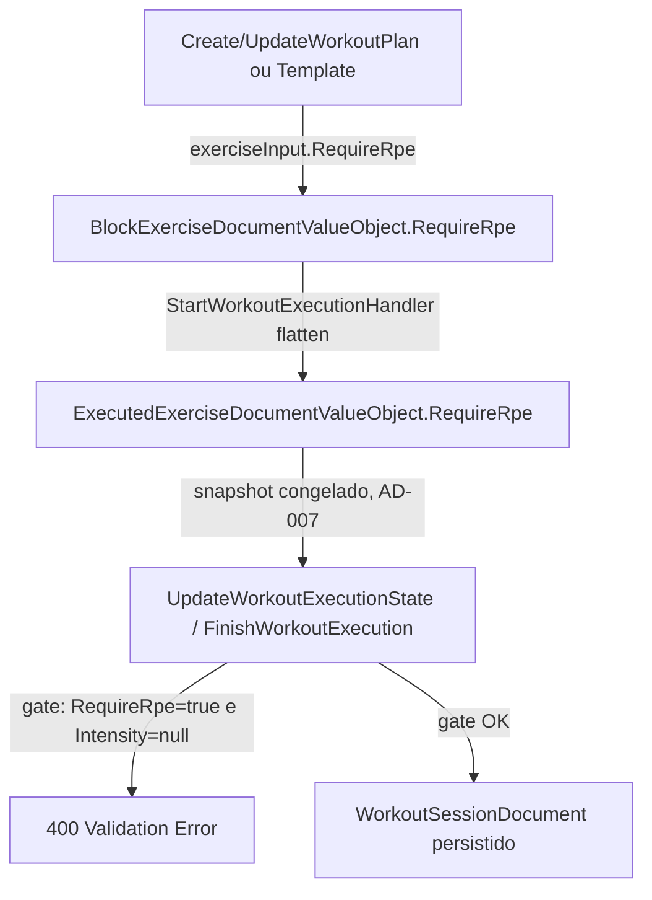

# Validação de Execução de Treino — Design

**Spec**: `.specs/features/workout-execution-validation/spec.md`
**Status**: Draft
**Scope note**: Este workspace (`ShapeUpApi`) só cobre os ACs marcados **[Backend]**. ACs **[Frontend]** (WEV-01, WEV-03, WEV-04, e as metades de UI de WEV-05/06/07/08) ficam pendentes para `ShapeUp-Web` — ver `## Cross-repo handoff` no final.

---

## Architecture Overview

Nenhum componente novo — extensão de modelos e validadores já existentes no domínio `Training`. Fluxo afetado:



`RequireRpe` nasce na autoria (Plans/Templates), é congelado no snapshot de execução no `Start` (mesmo espírito do AD-007 — decidido no início, não retroage numa sessão em andamento), e é o dado que os handlers de `Update`/`Finish` consultam para decidir se `Intensity` pode ser nulo.

---

## Code Reuse Analysis

### Existing Components to Leverage

| Component | Location | How to Use |
|---|---|---|
| `BlockExerciseDocumentValueObject` | `src/Features/Training/Shared/Documents/ValueObjects/BlockExerciseDocumentValueObject.cs` | Adicionar propriedade `RequireRpe` (bool, default `false`) |
| `ExecutedExerciseDocumentValueObject` | `src/Features/Training/Shared/Documents/ValueObjects/ExecutedExerciseDocumentValueObject.cs` | Adicionar `RequireRpe` (bool, default `false`) — snapshot congelado |
| `WorkoutExerciseDto` | `src/Features/Training/Workouts/Shared/Dtos/WorkoutExerciseDto.cs` | Adicionar `RequireRpe` (bool, default `false`) como último parâmetro posicional — já é o DTO reusado tanto na autoria (`BlockDto.Exercises`) quanto na execução (`UpdateWorkoutExecutionStateCommand.Exercises`/`FinishWorkoutExecutionCommand.Exercises`) |
| `UpdateWorkoutExecutionStateCommandValidator` | `.../UpdateWorkoutExecutionState/UpdateWorkoutExecutionStateCommandValidator.cs` | Remover `Intensity.NotNull()` incondicional (linha 25) — vira opcional por padrão; regra `InclusiveBetween(1,10)` quando presente já existe e continua |
| `TrainingErrors` | `src/Features/Training/Shared/Errors/TrainingErrors.cs` | Adicionar `RpeRequiredForExercise(int exerciseId)` → `CommonErrors.Validation(...)` |
| Padrão handler-level de regra pós-fetch (AD-005) | `UpdateWorkoutExecutionStateHandler.cs`/`FinishWorkoutExecutionHandler.cs` | O gate "RPE obrigatório quando `RequireRpe=true`" depende do snapshot da sessão (só conhecido pós-fetch) — mesmo padrão já usado pra ownership em Training, não dá pra expressar isso no `AbstractValidator` sem acoplar o validator a um repositório |
| Padrão de fallback já usado pra `ExerciseName` no Finish | `FinishWorkoutExecutionHandler.cs:48` (`session.Exercises.FirstOrDefault(...)?.ExerciseName ?? ...`) | Mesmo padrão pra recuperar `RequireRpe` do snapshot já existente da sessão em `Update`/`Finish`, em vez de tentar derivar de novnovo do catálogo de exercícios |

### Integration Points

| System | Integration Method |
|---|---|
| MongoDB (`WorkoutPlanDocument`/`WorkoutTemplateDocument`/`WorkoutSessionDocument`) | Novo campo `bool RequireRpe` em dois Value Objects aninhados — sem migração: driver Mongo usa o valor default (`false`) da propriedade quando o campo não existe em documento já persistido (mesmo espírito de reuso sem tabela nova do AD-002) |
| `CreateWorkoutPlan`/`UpdateWorkoutPlan`/`CreateWorkoutTemplate`/`UpdateWorkoutTemplate` handlers | Já mapeiam `exerciseInput` (`WorkoutExerciseDto`) → `BlockExerciseDocumentValueObject` um a um — só adicionar a atribuição do campo novo em cada um dos 4 |
| `WorkoutPlanMappings.ToResponse`/`.Clone`, `WorkoutTemplateMappings.ToBlockDtos` | Mapeiam de volta `BlockExerciseDocumentValueObject` → `WorkoutExerciseDto` (response) — adicionar `e.RequireRpe` no último parâmetro posicional |

---

## Components

### `BlockExerciseDocumentValueObject` (extensão)

- **Purpose**: Registrar, por exercício dentro de um bloco do plano/template, se RPE é obrigatório na execução daquele exercício.
- **Location**: `src/Features/Training/Shared/Documents/ValueObjects/BlockExerciseDocumentValueObject.cs`
- **Interfaces**: `public bool RequireRpe { get; set; } = false;`
- **Dependencies**: nenhuma
- **Reuses**: mesmo VO já usado por planos e templates

### `ExecutedExerciseDocumentValueObject` (extensão)

- **Purpose**: Carregar o snapshot congelado de `RequireRpe` pra dentro da sessão de execução, decidido no `Start` (AD-007: execução não retroage a mudanças no plano).
- **Location**: `src/Features/Training/Shared/Documents/ValueObjects/ExecutedExerciseDocumentValueObject.cs`
- **Interfaces**: `public bool RequireRpe { get; set; } = false;`
- **Dependencies**: nenhuma
- **Reuses**: mesmo VO já usado no schema de `WorkoutSessionDocument`

### `WorkoutExerciseDto` (extensão)

- **Purpose**: Trafegar `RequireRpe` no request/response de autoria (Plans/Templates) — reusado também (e ignorado no gate) nos comandos de execução.
- **Location**: `src/Features/Training/Workouts/Shared/Dtos/WorkoutExerciseDto.cs`
- **Interfaces**: `public record WorkoutExerciseDto(int ExerciseId, WorkoutSetValueObject[] Sets, double? StrengthGainPercentage = null, bool RequireRpe = false);`
- **Dependencies**: nenhuma
- **Reuses**: DTO único já compartilhado entre autoria e execução — parâmetro novo com default `false` é retrocompatível (clientes antigos que não enviam o campo continuam funcionando)

### `WorkoutExerciseDtoValidator` (novo, pequeno, compartilhado)

- **Purpose**: Regras de formato de peso/reps/faixa de RPE por set, hoje só existentes em `UpdateWorkoutExecutionStateCommandValidator` — extraídas pra um validador de item reusável e aplicadas também em `FinishWorkoutExecutionCommandValidator` (ver Risks & Concerns — hoje esse validador não valida `Exercises` de jeito nenhum, um gap real de defense-in-depth).
- **Location**: `src/Features/Training/Workouts/Shared/Dtos/WorkoutExerciseDtoValidator.cs` (novo arquivo)
- **Interfaces**: `class WorkoutExerciseDtoValidator : AbstractValidator<WorkoutExerciseDto>` — mesmas regras já existentes (`ExerciseId > 0`, `Sets.NotEmpty()`, `Repetitions` not-null/`> 0`, `Load >= 0`, `LoadUnit`/`SetType` in enum, `Intensity.Value` `InclusiveBetween(1,10)` quando presente, `RestSeconds` not-null/`>= 0`), MENOS a regra `Intensity.NotNull()` incondicional (removida — vira condicional, resolvida no handler)
- **Dependencies**: FluentValidation
- **Reuses**: regras já escritas em `UpdateWorkoutExecutionStateCommandValidator` — só reorganizadas pra um validador de item, sem mudar semântica das que já existiam

### Handler-level RPE gate (extensão em 2 handlers)

- **Purpose**: Rejeitar com 400 quando um set de um exercício `RequireRpe=true` (lido do snapshot da sessão) chega sem `Intensity`.
- **Location**: `UpdateWorkoutExecutionStateHandler.cs` e `FinishWorkoutExecutionHandler.cs` (dentro do bloco que já itera `command.Exercises`, logo após resolver o exercício correspondente no snapshot da sessão)
- **Interfaces**: lógica inline — para cada `exerciseInput`, `var requireRpe = session.Exercises.FirstOrDefault(x => x.ExerciseId == exerciseInput.ExerciseId)?.RequireRpe ?? false;` seguido de `if (requireRpe && exerciseInput.Sets.Any(s => s.Intensity is null)) return Result...Failure(TrainingErrors.RpeRequiredForExercise(exerciseInput.ExerciseId));`
- **Dependencies**: `session` já buscado nesse ponto do handler (pós-fetch, AD-005)
- **Reuses**: mesmo padrão de fallback via `session.Exercises.FirstOrDefault(...)` já usado pra `ExerciseName` no Finish

---

## Data Models

### `BlockExerciseDocumentValueObject` (após mudança)

```csharp
public class BlockExerciseDocumentValueObject
{
    public int ExerciseId { get; set; }
    public string ExerciseName { get; set; } = string.Empty;
    public double? StrengthGainPercentage { get; set; }
    public bool RequireRpe { get; set; } = false;   // NOVO
    public List<PlannedSetDocumentValueObject> Sets { get; set; } = [];
}
```

### `ExecutedExerciseDocumentValueObject` (após mudança)

```csharp
public class ExecutedExerciseDocumentValueObject
{
    public int ExerciseId { get; set; }
    public string ExerciseName { get; set; } = string.Empty;
    public bool RequireRpe { get; set; } = false;   // NOVO — snapshot congelado no Start
    public List<ExecutedSetDocumentValueObject> Sets { get; set; } = [];
}
```

**Relationships**: `RequireRpe` flui `BlockExerciseDocumentValueObject` (autoria, editável) → `ExecutedExerciseDocumentValueObject` (execução, congelado no `Start`, só recopiado — nunca recalculado — em `Update`/`Finish`).

---

## Error Handling Strategy

| Error Scenario | Handling | User Impact |
|---|---|---|
| Set de exercício `RequireRpe=true` chega sem `Intensity` em `UpdateWorkoutExecutionState`/`FinishWorkoutExecution` | Handler retorna `Result.Failure(TrainingErrors.RpeRequiredForExercise(exerciseId))` → 400, sessão não é alterada | Cliente recebe 400 com mensagem indicando o exercício; nenhuma escrita parcial (mesmo padrão já existente — validação/gate sempre antes de qualquer `UpdateStateAsync`/`UpdateCompletionAsync`) |
| `Repetitions` nulo/`<=0` ou `Load` negativo em qualquer set (`Update` ou `Finish`) | `WorkoutExerciseDtoValidator` rejeita antes do handler rodar | 400, nenhuma persistência (mesmo padrão já existente pro `Update`; NOVO pro `Finish`, que hoje não valida nada) |
| `Intensity.Value` fora de `1..10` | Regra já existente, mantida | 400 |
| Exercício sem `RequireRpe` (default) e `Intensity == null` | Aceito normalmente — fix do bug atual que hoje rejeita `Intensity` nulo sempre | Nenhum impacto negativo — corrige regressão |

---

## Risks & Concerns

| Concern | Location (file:line) | Impact | Mitigation |
|---|---|---|---|
| `FinishWorkoutExecutionCommandValidator` não valida `Exercises`/`Sets` de jeito nenhum hoje (nenhuma regra de `Repetitions`/`Load`/`Intensity`) — um cliente pode contornar toda a validação de integridade de dado enviando via `Finish` em vez de `Update` | `src/Features/Training/Workouts/FinishWorkoutExecution/FinishWorkoutExecutionCommandValidator.cs:5-13` | Bypass real do gate de "peso/reps válidos" e do RPE-obrigatório-condicional que esta spec pede — mina o próprio objetivo do WEV-02 ("backend rejeita se contornado") | Extrair `WorkoutExerciseDtoValidator` (ver Components) e aplicar em AMBOS os validators via `RuleForEach(x => x.Exercises).SetValidator(...)`, com `.When(x => x.Exercises is not null)` no Finish (campo é opcional lá) |
| `UpdateWorkoutExecutionStateHandler.cs:64` e `FinishWorkoutExecutionHandler.cs:56` fazem `s.Intensity!.Type`/força-unwrap condicionado à regra `NotNull()` do validador atual | mesmos arquivos | Ao remover `Intensity.NotNull()` incondicional, esse force-unwrap quebra com `NullReferenceException` quando `Intensity` vier nulo (caso agora válido) | Trocar para o padrão já usado em `StartWorkoutExecutionHandler.cs:66` (`s.Intensity is null ? null : new IntensityDocumentValueObject {...}`) nos dois handlers |
| `CreateWorkoutTemplateHandler`/`UpdateWorkoutTemplateHandler` não setam `StrengthGainPercentage` no `BlockExerciseDocumentValueObject` (diferente dos handlers de `WorkoutPlan`, que setam) | `src/Features/Training/WorkoutTemplates/CreateWorkoutTemplate/CreateWorkoutTemplateHandler.cs:36-39`, `UpdateWorkoutTemplate/UpdateWorkoutTemplateHandler.cs:45-48` | Bug pré-existente, fora do escopo desta spec (não mencionado em nenhum AC) — só registrado aqui pra não confundir com o `RequireRpe` novo (que SERÁ setado nos 4 handlers, diferente desse campo antigo que só falta em 2) | Nenhuma ação nesta feature — não é regressão introduzida por ela, é comportamento pré-existente não relacionado a RPE |

> Nenhum outro risco de segurança/performance identificado — mudança é aditiva (novo campo bool com default seguro) e reusa infraestrutura de validação/autorização já existente.

---

## Tech Decisions (only non-obvious ones)

| Decision | Choice | Rationale |
|---|---|---|
| Onde mora o gate "`RequireRpe` ⇒ `Intensity` obrigatório" | Handler-level (pós-fetch da sessão), não no `AbstractValidator` | Segue AD-005: a informação (`RequireRpe` por exercício) só existe no snapshot da sessão, buscado depois que o validator de forma já rodou — validator não tem acesso a repositório |
| Extrair `WorkoutExerciseDtoValidator` reusável entre `Update` e `Finish` | Sim, novo arquivo pequeno em vez de duplicar as regras de set no `FinishWorkoutExecutionCommandValidator` | Fecha o gap de defense-in-depth do Finish (ver Risks) sem duplicar a mesma lista de regras em dois lugares |
| Nome do campo novo | `RequireRpe` (bool, default `false`) | Nome já usado consistentemente na spec (Assumptions); sem sufixo/prefixo adicional, mesmo padrão direto de outros bools do domínio (`IsCompleted`, `IsCancelled`, `IsExtra`) |
| Sem migração de dado para documentos Mongo já existentes | Confiar no default `false` do driver Mongo pra campo ausente | Mesmo espírito do AD-002 (reuso sem tabela/migração nova quando o default já resolve) |

Nenhuma decisão aqui estabelece convenção nova pro projeto (é extensão pontual de um VO já existente seguindo padrões já ativos) — não gera `AD-NNN` novo em `STATE.md`.

---

## Cross-repo handoff

Backend entrega, quando este Execute fechar: `RequireRpe` persistido em Plans/Templates/Sessions, gate 400 server-side (WEV-02, WEV-05 backend, WEV-06 backend, WEV-07 backend, WEV-08 backend já coberto pela regra existente). O que fica pendente pro `ShapeUp-Web` (fora deste workspace):

- WEV-01: gate client-side de peso/reps na tela de execução (`TrainingPlansClient.jsx`)
- WEV-03/WEV-04: correções de i18n (`t()`/`LanguageContext`) pro timer "Rest" e pros rótulos de fase/dificuldade
- WEV-05/06/07 (metade frontend): toggle "RPE obrigatório" por exercício no `workout-editor`, botão de bulk toggle, e o bloqueio client-side de conclusão de set sem RPE — todos consomem o campo `requireRpe` que o backend passa a expor em `WorkoutExerciseDto`/response de plano e no snapshot da sessão
- WEV-08 (metade frontend): clamp/validação de RPE 1-10 no campo de log da UI

Registrar esse handoff em `.specs/STATE.md` ao final do Execute (mesmo padrão já usado pro handoff `workout-editor` → `stitch-migration T19`).
