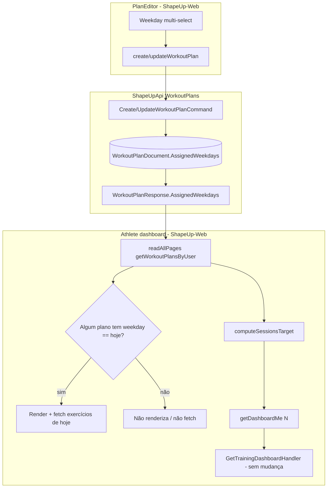

# Agenda Semanal do Treino no Dashboard — Design

**Spec**: `.specs/features/workout-schedule-dashboard/spec.md`
**Status**: Approved · Backend Verified PASS — see `validation.md`

---

## Architecture Overview

Uma capability aditiva no agregado de planejamento (`WorkoutPlanDocument`, Mongo) + consumo no dashboard web. Sem endpoint novo, sem mudança de contrato em `GET /api/training/dashboard/me`.

1. **Backend**: campo `AssignedWeekdays` em `WorkoutPlanDocument`, propagado em Create/Update/Get/Copy/Assign→Plan e no `WorkoutPlanResponse`.
2. **Dashboard (backend)**: `GetTrainingDashboardHandler` permanece intacto — continua recebendo `sessionsTargetPerWeek` do chamador (WSD-07).
3. **Frontend (`ShapeUp-Web`)**: seletor multi-dia no `PlanEditor`; dashboard calcula denominador e decide se renderiza/fetcha o card "hoje" a partir de `assignedWeekdays` retornado por `getWorkoutPlansByUser`.



**Escopo de Execute neste repo**: só metade **[Backend]** (WSD-01, WSD-07). Metade **[Frontend]** (WSD-02..WSD-06) é handoff para `ShapeUp-Web` após o Verifier backend PASS — mesmo padrão de `workout-execution-validation`.

---

## Code Reuse Analysis

### Existing Components to Leverage

| Component | Location | How to Use |
|---|---|---|
| `WorkoutPlanDocument` | `Features/Training/Shared/Documents/WorkoutPlanDocument.cs` | Adicionar `AssignedWeekdays` (lista); default `[]` — docs Mongo existentes sem o campo deserializam como vazio |
| `Difficulty` BSON string enum pattern | mesmo documento (`[BsonRepresentation(BsonType.String)]`) | Aplicar o mesmo em cada item de `AssignedWeekdays` via serializer de lista de enum string (ou enum `.NET DayOfWeek` com representação string) |
| `CreateWorkoutPlanHandler` / `UpdateWorkoutPlanHandler` | `WorkoutPlans/Create*` / `Update*` | Mapear o campo novo; dedupe antes de persistir |
| `CreateWorkoutPlanCommandValidator` / `UpdateWorkoutPlanCommandValidator` | mesmos dirs | `RuleForEach` + `IsInEnum`; não rejeitar duplicata (handler dedupe — WSD-01 AC3) |
| `WorkoutPlanMappings.Clone` / `ToResponse` | `WorkoutPlans/Shared/WorkoutPlanMappings.cs` | Copiar `AssignedWeekdays` no clone; incluir no response (mesmo padrão `RequireRpe`) |
| `AssignWorkoutTemplateHandler` | `WorkoutTemplates/AssignWorkoutTemplate/` | Novo plano nasce com `AssignedWeekdays = []` (template não ganha o campo nesta feature — fora do pedido) |
| `GetTrainingDashboardHandler` | `Dashboard/GetTrainingDashboard/` | **Não tocar** — já valida `N > 0` e usa o valor (WSD-07) |
| `ITrainingAccessPolicy` (AD-005) | Training handlers | Sem mudança de auth — campo no mesmo write path já autorizado |
| `normalizePlan` + `PlanEditor` | `ShapeUp-Web/src/utils/trainingNormalization.js`, `ClientDetail.jsx` | Frontend: carregar/salvar `assignedWeekdays` |
| `OperationalDashboardsShell` + `AthleteDashboardMarkup` | `ShapeUp-Web/.../Dashboard/` | Frontend: card "hoje" + denominador dinâmico |
| `readAllPages` | já usado em `OperationalDashboardsShell.tsx:150` | Garante que WSD considera TODOS os treinos, não só `plans[0]` |

### Integration Points

| System | Integration Method |
|---|---|
| `workout-editor` (Create/Update plan) | Campo opcional no body JSON (`assignedWeekdays: string[]`) — camelCase ASP.NET default |
| `GET .../workout-plans/by-user` | Response passa a incluir `assignedWeekdays` em cada item — sem breaking change (campo aditivo) |
| `GET /api/training/dashboard/me` | Sem mudança; frontend deixa de mandar `5` |
| Mongo Training store | Schema-less — sem migration; docs antigos = lista vazia |
| Offline / client-supplied plan id | Sem impacto — `CreateWorkoutPlanCommand.Id` continua igual |

---

## Components

### AssignedWeekdays on WorkoutPlanDocument

- **Purpose**: Persistir 0–7 dias da semana atribuídos a um treino (unidade agendável = o próprio `WorkoutPlanDocument`, não Block — ver Assumptions da spec).
- **Location**: `src/Features/Training/Shared/Documents/WorkoutPlanDocument.cs`
- **Interfaces**:
  - `List<DayOfWeek> AssignedWeekdays { get; set; } = [];` — `System.DayOfWeek` (Sunday=0…Saturday=6), alinhado a `Date.getDay()` no browser
  - Persistência: representação string BSON (`"Monday"`, …) para legibilidade/compat, igual `Difficulty`
- **Dependencies**: nenhum serviço novo
- **Reuses**: padrão de enum string já usado no mesmo documento

### Create/Update command surface

- **Purpose**: Aceitar e validar `AssignedWeekdays` no write path.
- **Location**:
  - `CreateWorkoutPlanCommand` / `UpdateWorkoutPlanCommand` — param `DayOfWeek[]? AssignedWeekdays = null`
  - Handlers correspondentes — `AssignedWeekdays = Deduplicate(command.AssignedWeekdays ?? [])`
  - Validators — cada valor `IsInEnum`; lista pode ser null/empty
- **Interfaces**:
  - `Deduplicate(IEnumerable<DayOfWeek>) → List<DayOfWeek>` — order-stable distinct (primeira ocorrência vence)
- **Dependencies**: FluentValidation existente
- **Reuses**: mesmo ciclo Create/Update de `RequireRpe` / blocks

### WorkoutPlanResponse + mappings

- **Purpose**: Expor o campo em todas as leituras (GetById, GetByUser, Create/Update response, Copy, Assign).
- **Location**: `WorkoutPlanResponse`, `WorkoutPlanMappings.ToResponse` / `Clone`, `WorkoutTemplateMappings.ToPlanResponse` se espelhar plan response
- **Interfaces**: `DayOfWeek[] AssignedWeekdays` no record de response
- **Dependencies**: documento fonte
- **Reuses**: `ToResponse` central — um ponto evita drift

### Dashboard denominator (frontend-only helper)

- **Purpose**: Calcular `N` para `getDashboardMe(N)` e decidir visibilidade do card "hoje".
- **Location** (Web): util puro sugerido em `src/utils/workoutSchedule.js` (ou colocalizado no shell) — testável sem React
- **Interfaces**:
  - `getLocalWeekday(date = new Date()): DayOfWeek` — `date.getDay()` (local TZ, WSD edge case)
  - `plansForToday(plans, weekday): Plan[]`
  - `computeSessionsTargetPerWeek(plans): number | null` — `null` quando zero treinos (UI mostra "—", não chama API com 0)
  - Regra: se algum plano tem `assignedWeekdays.length > 0` → `|∪ assignedWeekdays|`; senão → `plans.length`
- **Dependencies**: lista completa de planos (`readAllPages`)
- **Reuses**: nenhum cálculo no backend

### PlanEditor weekday selector (frontend)

- **Purpose**: Multi-seleção Seg–Dom por treino; limpar todos = lista vazia válida.
- **Location**: `ClientDetail.jsx` `PlanEditor` (header do formulário, junto de phase/difficulty/weeks)
- **Interfaces**: state `assignedWeekdays: number[]` (0–6); payload no `onSave`
- **Dependencies**: i18n labels curtos (`t('…')`)
- **Reuses**: padrões de chip/toggle já usados no shell profissional se houver; senão botões toggle simples sem card novo

---

## Data Models

### WorkoutPlanDocument (delta)

```csharp
// System.DayOfWeek — Sunday=0 … Saturday=6
public List<DayOfWeek> AssignedWeekdays { get; set; } = [];
```

**Relationships**: pertence ao agregado de plano; não referencia outros documentos. Templates **não** ganham o campo nesta feature.

### API contract (JSON)

```json
{
  "name": "Upper Body",
  "assignedWeekdays": ["Monday", "Thursday"],
  "blocks": [ ... ]
}
```

Response espelha o mesmo array (sempre presente; `[]` quando vazio). Docs legados sem o campo → `[]` na deserialização.

### Frontend internal shape (`normalizePlan`)

```js
{
  // ...campos existentes
  assignedWeekdays: plan.assignedWeekdays ?? [], // strings "Monday"… ou números 0–6 — normalizar pra number[] interno
}
```

---

## Error Handling Strategy

| Error Scenario | Handling | User Impact |
|---|---|---|
| Valor fora do enum DayOfWeek no body | FluentValidation → 400 | Mensagem de validação padrão |
| Dias duplicados no payload | Dedupe no handler, **não** 400 (WSD-01 AC3) | Persistido sem duplicata |
| `sessionsTargetPerWeek <= 0` | Já rejeitado pelo handler de dashboard | Frontend evita chamar com 0 (WSD-06 AC4) |
| Plano sem `assignedWeekdays` (legado) | Trata como `[]` | Card "hoje" oculto; denominador = contagem de treinos |
| Paginação incompleta no dashboard | Já mitigado por `readAllPages` | Se alguém chamar sem paginar, denominador/card ficam incompletos — documentado em Risks |

---

## Risks & Concerns

| Concern | Location | Impact | Mitigation |
|---|---|---|---|
| Fuso: numerador usa semana UTC (segunda→segunda) no backend; "hoje" e denominador usam TZ local no frontend | `GetTrainingDashboardHandler.StartOfWeekUtc` vs `new Date().getDay()` | Possível desalinhamento perto de meia-noite / DST na borda da semana | Aceito pela spec (assumptions); não unificar fuso nesta feature. Documentar no handoff Web |
| "Plano ativo" = todos os planos do usuário (dívida pré-existente) | `OperationalDashboardsShell.tsx:202` (`plans[0]`) | Card "hoje" antigo só olhava o 1º plano | Esta feature **corrige** o escopo: filtrar/agregar TODOS os planos com weekday de hoje |
| `Clone`/`Assign` esquecerem o campo novo | `WorkoutPlanMappings.Clone`, `AssignWorkoutTemplateHandler` | Copy silencia agendamento; Assign ok com `[]` | Tasks explícitas cobrindo Clone + Assign; teste de Clone com weekdays preenchidos |
| Serialização DayOfWeek string vs number no JSON | ASP.NET default enum | Frontend pode receber número se config mudar | Fixar string via options existentes do projeto (mesmo `Difficulty`); testes de handler assertam o shape do response |
| GymManagement adherence calculator lê `WorkoutPlanDocument` | `TrainerClientAdherenceCalculator.cs` | Ignora o campo novo — ok | Fora de escopo; sem uso de weekdays lá |

---

## Tech Decisions (non-obvious)

| Decision | Choice | Rationale |
|---|---|---|
| Onde vive o agendamento | `WorkoutPlanDocument`, não Block | Spec + AD-007 (Block = técnica de execução, não unidade agendável) |
| Tipo do dia | `System.DayOfWeek` | Alinha backend e `Date.getDay()`; evita enum custom paralelo |
| Dashboard calcula N? | Não — frontend calcula e envia | Spec WSD-07 / menor diff; endpoint já pronto |
| Templates ganham weekdays? | Não nesta feature | Pedido é no editor de plano do usuário; Assign → `[]` |
| Dedupe vs reject | Dedupe | WSD-01 AC3 explícito |
| Ordem de Execute | Backend primeiro neste repo; Web depois | Mesmo padrão Fase 3.5 (`workout-execution-validation`) |

> Nenhuma decisão aqui sobe a `STATE.md` como AD-NNN — são feature-local e conformam AD-005/AD-007 sem superseder.

---

## Requirement → Design mapping

| ID | Camada | Design touchpoint |
|---|---|---|
| WSD-01 | Backend | Document + Create/Update + dedupe + response/clone |
| WSD-02 | Frontend | `PlanEditor` multi-select + `normalizePlan` + save payload |
| WSD-03 | Frontend | `plansForToday` → render card |
| WSD-04 | Frontend | short-circuit: sem planos de hoje → sem fetch do card |
| WSD-05 | Frontend | `computeSessionsTargetPerWeek` (union de dias) |
| WSD-06 | Frontend | fallback `plans.length`; empty → não chama com 0 |
| WSD-07 | Backend | **no-op** confirmado — regression test opcional no handler existente |
