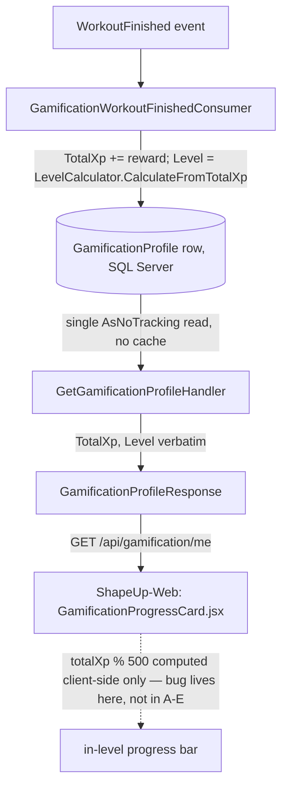

# XP Feedback Loop — Design

**Spec**: `.specs/features/xp-feedback-loop/spec.md`
**Status**: Approved
**Scope note**: Este workspace (`ShapeUpApi`) só cobre a investigação de causa raiz e o AC **[Backend]** (XPF-04) e a metade backend de XPF-06. XPF-01/02/03/05 (popup, polling, slot de imagem, render da barra) são 100% **[Frontend]** — ficam em `ShapeUp-Web`, sem contraparte de código neste repo.

---

## Root Cause Investigation (XPF-06 — mandatory before proposing a fix)

**Conclusion: there is no backend defect.** `TotalXp` and `Level` cannot diverge, and there is no cache/staleness window between XP credit and `GET /api/gamification/me` reflecting it.

Evidence (all `ShapeUpApi`):

1. **`Level` is a stored column, computed and written atomically with `TotalXp`.** `GamificationWorkoutFinishedConsumer.ApplyCredit` increments `profile.TotalXp` and immediately recomputes `profile.Level = LevelCalculator.CalculateFromTotalXp(profile.TotalXp)` on the SAME tracked EF Core entity (`src/Features/Gamification/WorkoutFinished/GamificationWorkoutFinishedConsumer.cs:108,115`), persisted by a SINGLE `SaveChangesAsync` call (`:92`) — one row, one transaction. No split-write window exists. Same pattern in `GamificationNutritionGoalMetConsumer.cs:44,51`, single `SaveChangesAsync` at `:61` (verified independently by the Verifier — an earlier draft of this doc misattributed these lines to the wrong file).
2. **The read path has zero caching.** `GetGamificationProfileHandler` (`src/Features/Gamification/GetGamificationProfile/GetGamificationProfileHandler.cs:13-27`) does a single `AsNoTracking()` EF Core read of the same `GamificationProfile` row, maps `TotalXp`/`Level` verbatim into `GamificationProfileResponse` (no in-level math applied server-side at all). Repo-wide search for `IMemoryCache`/`IDistributedCache`/`ResponseCache`/`OutputCache` under `src/Features/Gamification` and `src/` returns zero matches.
3. **No server-side "XP in current level" field exists anywhere** — not on `GamificationProfile` (`src/Features/Gamification/Shared/Entities/GamificationProfile.cs`), not on the response DTO. The `totalXp % 500` math the spec describes is a purely client-side computation (per the spec's own Problem Statement, `GamificationProgressCard.jsx:31`) — there is nothing on the backend that could zero it out independently of `TotalXp`, because the backend never computes it.
4. **Existing test coverage already proves the invariant holds today**: `GamificationWorkoutFinishedConsumerTests.Consume_WhenXpCrossesLevelThreshold_RecordsLevelUpSnapshot` (`tests/UnitTests/Domains/Gamification/GamificationWorkoutFinishedConsumerTests.cs:217-250`) credits XP from 480→530 (crossing the 500 threshold) and asserts `TotalXp=530`, `Level=2` together after one write. `GetGamificationProfileHandlerTests.HandleAsync_WhenProfileExists_...` (`tests/UnitTests/Domains/Gamification/GetGamificationProfileHandlerTests.cs:51-100`) asserts a read of `TotalXp=750`/`Level=2` together (750 is not a multiple of 500 — a non-zero in-level remainder). Neither test could pass under the "level right, in-level XP wrong" symptom described in the spec, because both assert the same two fields from the same object/row in the same assertion block.

**Conclusion**: XPF-06's root cause is **frontend-only**. The most likely explanations (documented for `ShapeUp-Web`'s Design phase, not fixable here):
- The progress-bar component reads `totalXp` from a stale/differently-sourced value than the one used for `level`/`shapeScore` in the same render (e.g., a memoization or prop-drilling bug).
- A field-name mismatch (wrong casing/typo) silently coercing the percentage math to 0/`NaN` while `level`/`shapeScore` (read from correctly-named fields) render fine.
- A `useEffect` computing `xpInCurrentLevel` once on mount (with `totalXp=0`) and never re-deriving it when a fresh profile arrives.

No backend code change is required or appropriate to "fix" this — there is nothing broken on this side to fix. `ShapeUp-Web`'s own Design phase must investigate `GamificationProgressCard.jsx` directly (out of reach from this workspace).

---

## Architecture Overview

No new component, no new endpoint. This feature is a **verification + documentation** task on the backend side of the codebase: confirm `GET /api/gamification/me`'s existing contract already satisfies XPF-04, and add one explicit regression test that locks in the `TotalXp`/`Level` consistency invariant at the exact seam a future regression is most likely to break it (the read-response mapping), complementing the write-path test that already exists.

---

## Code Reuse Analysis

### Existing Components to Leverage

| Component | Location | How to Use |
|---|---|---|
| `LevelCalculator.CalculateFromTotalXp` | `src/Features/Gamification/Shared/LevelCalculator.cs` | Reused as the oracle in the new regression test — assert the response's `Level` matches this function applied to the response's `TotalXp`, not a hardcoded pair |
| `GetGamificationProfileHandlerTests` | `tests/UnitTests/Domains/Gamification/GetGamificationProfileHandlerTests.cs` | Extend with one new test case, following its existing InMemory-EF-Core + `ShapeScoreCalculator` setup pattern |

No new production code is added by this feature on the backend.

---

## Components

No new components. This feature does not modify `GetGamificationProfileHandler`, `GamificationProfileResponse`, `GamificationWorkoutFinishedConsumer`, or any Gamification entity — all are already correct per the investigation above.

---

## Error Handling Strategy

Not applicable — no new code path, no new error scenario.

---

## Risks & Concerns

| Concern | Location (file:line) | Impact | Mitigation |
|---|---|---|---|
| `src/Features/Gamification/` has no `ARCHITECTURE.md`, unlike every other domain (`AuditLogs`, `Authorization`, `Credentials`, `Entitlements`, `GymManagement`, `Memberships`, `Notifications`, `Nutrition`, `PlatformFeatureFlags`, `Relationships`, `Training` all have one) — a pre-existing gap relative to `src/AGENTS.md`'s "every implemented domain must include an architecture file" convention | `src/Features/Gamification/` (missing file) | Not blocking for this feature (spec doesn't ask for it, out of scope per Out of Scope table's "no new gamification mechanics"), but flagged here since a future feature touching this domain will hit the same gap | Out of scope for `xp-feedback-loop` — noted here for visibility; a future Gamification-domain feature should add it as its own task, not bundled into this unrelated fix |

> No security/performance/test-coverage concern found in the investigated code paths — the write and read paths are both already correct, atomic, and covered.

---

## Tech Decisions (only non-obvious ones)

| Decision | Choice | Rationale |
|---|---|---|
| No backend code fix for XPF-06 | Confirmed root cause is frontend-only; no backend change made | Making a speculative backend change with no identified defect would be scope creep with no spec anchor — violates "no features beyond what was asked" |
| Add one regression test instead of zero | `GetGamificationProfileHandlerTests` gets a new case asserting `Level == LevelCalculator.CalculateFromTotalXp(TotalXp)` for a non-level-boundary `TotalXp` | Directly answers spec XPF-04 AC1's requirement for the two fields' consistency to be verifiable, and gives `ShapeUp-Web` a citable backend contract guarantee to build the frontend fix against, even though the invariant already held before this feature |

No decision here sets a new project-wide convention — no `AD-NNN` entry needed in `STATE.md`.

---

## Cross-repo handoff

Backend contributes, when this Execute closes: confirmation (via existing + one new test) that `GET /api/gamification/me` already returns `TotalXp`/`Level` consistently, and a written root-cause finding ruling out the backend. Everything else in this spec is `ShapeUp-Web` work:

- XPF-01/02/03: the XP celebration popup itself (pending state, polling against `GET /api/gamification/me`, image placeholder slot) — no backend change needed, endpoint already exists and returns everything required (`TotalXp`)
- XPF-05: fix the actual progress-bar rendering bug in `GamificationProgressCard.jsx` — per this investigation, the fix is entirely in that file (or wherever it sources `totalXp` from); no API contract change is needed on the way in
- XPF-06 (frontend half): `ShapeUp-Web`'s own Design phase should investigate `GamificationProgressCard.jsx` directly using the three hypotheses above as a starting point, and add its own regression test reproducing the broken state before fixing it (per spec AC5) — this repo's investigation confirms the bug is reproducible on the frontend alone (feed it any `TotalXp` not a multiple of 500 and inspect the render), no backend fixture/mock needed to reproduce it

Register this handoff in `.specs/STATE.md` once Execute closes, same pattern as the two prior features.
